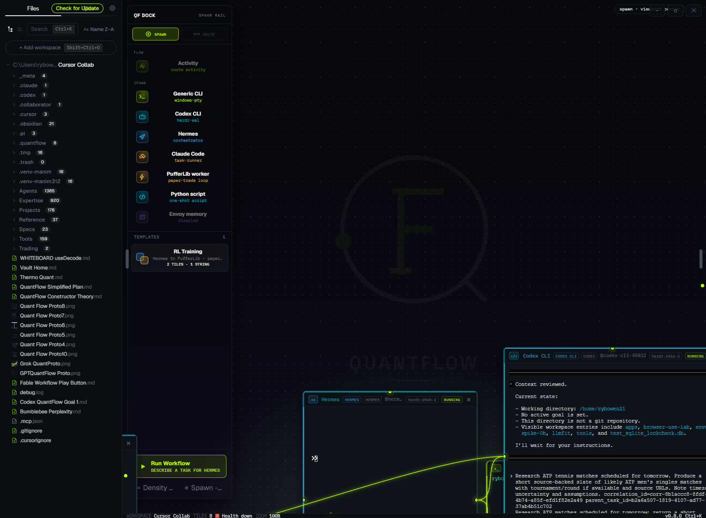
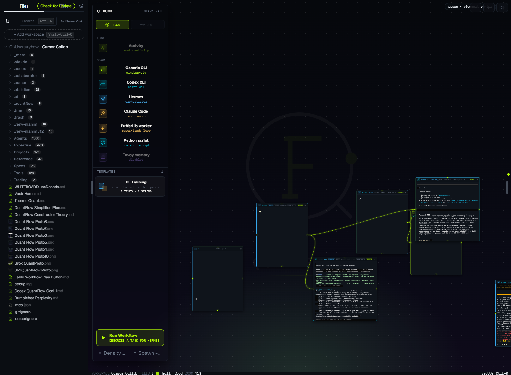

# QuantFlow

**Where autonomous work becomes visible, coordinated, and provable.**

QuantFlow is an infinite-canvas desktop workspace for orchestrating real multi-agent work. Spawn Hermes, Codex, Claude, and other workers as live terminal tiles; connect them with cables; run task graphs with verification gates and receipts. The **Kernel** owns truth — the canvas only projects it.





## What it does today

- **Canvas-first cockpit** — pan/zoom infinite surface; each tile is a real terminal (WSL via herdr, or Windows PTY).
- **One-click agents** — Legend dock spawns orchestrators and workers; cables declare how work flows between tiles.
- **Governed task lifecycle** — create → claim → submit → verify → complete; downstream steps wait on verified upstream work (DAG scheduling).
- **Single task authority** — Kernel commands first; Envoy mirrors for inbox and vault export.
- **MCP tool surface** — agents call `qf_task_*`, tile/cable ops, and read-only Kernel queries on `:9811`.
- **Conductor** — in-process planner with approval-gated steps; operator can advance one action at a time.
- **Obsidian vault mirror** — durable operator memory, canvas skill, and Envoy evidence under your vault.

Early **v4** development on branch `quantflow-v4` (extends the shipped v3 spine). Windows-first; macOS/Linux paths exist but are less dogfooded.

## Quickstart (dev)

**Prerequisites:** Node.js 22+, Bun. Windows: PowerShell 7 + WSL2 for herdr-backed tiles. See [WINDOWS_DEV_SETUP.md](WINDOWS_DEV_SETUP.md).

```powershell
git clone https://github.com/SidNig21/QuantFlow.git
cd QuantFlow
git checkout quantflow-v4
cd quantflow-electron
bun install
bun run dev
```

Pair an Obsidian vault (default: `QuantFlow Vault`) so Run Workflow and canvas skills resolve. Configure in-app or via `%USERPROFILE%\.quantflow\vault-config.json`.

## Stack

Electron · React · Tailwind · xterm.js · herdr (WSL) · SQLite Kernel · MCP adapter · Obsidian mirror

## Docs

| Doc | Purpose |
| --- | --- |
| [CONCEPT.md](CONCEPT.md) | Product spine |
| [BUILD_PLAN_V4.md](BUILD_PLAN_V4.md) | Current v4 rung ladder |
| [KERNEL_CONSTITUTION.md](KERNEL_CONSTITUTION.md) | Authority rules |
| [AGENTS.md](AGENTS.md) | Agent entry + DOX chain |

## License

See repository license file.
