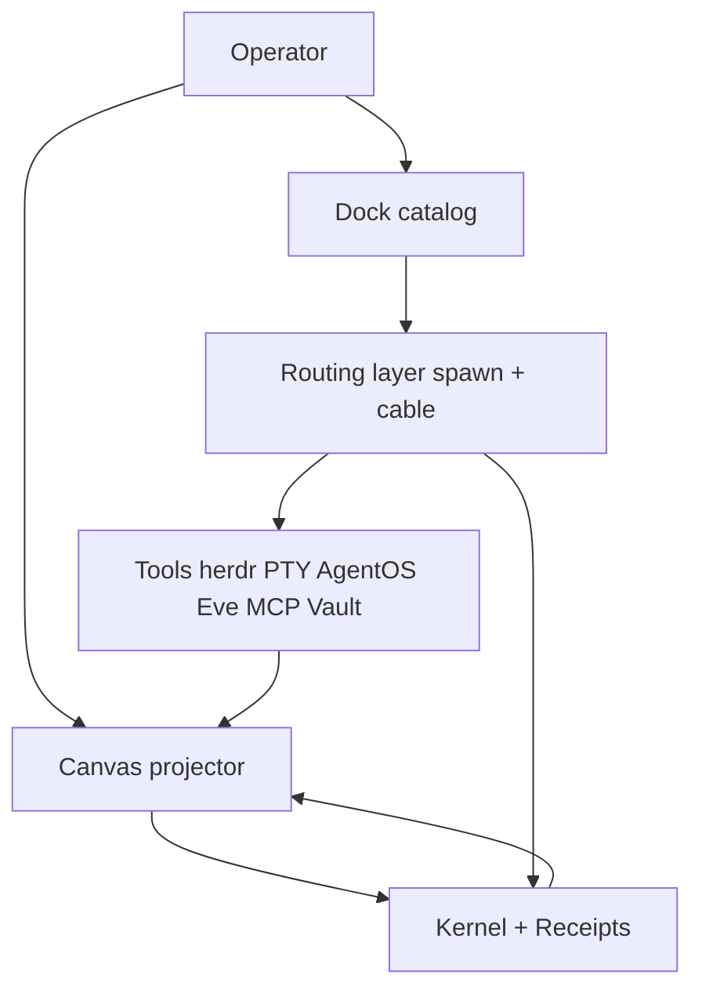
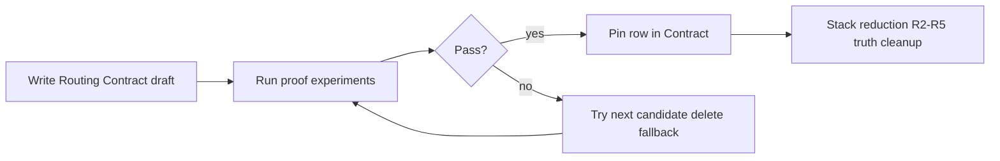

# QuantFlow Layer Routing - Plan

## Goal Capsule

**Objective:** Decide QuantFlow's layer routing on purpose — which tool runs where, which layer owns truth — using evidence and a written Routing Contract, not legacy habit or a permanent three-backend spreadsheet.

**Product authority:** `docs/v6/STACK_REDUCTION_LADDER.md` (v6 restructure execution). Operator layer reference: `Obsidian/Cursor Collab/QuantFlow Map.md` (update with Routing Contract when decisions land).

**Open blockers:** R2 live cable proof still pending. Spawn path for named dock cards (Claude/Codex/Eve) not chosen by proof yet. Legacy herdr name-injection is a **candidate**, not the default answer.

---

## Product Contract

### Summary

QuantFlow keeps its tools (herdr, Windows terminals, AgentOS, Eve, MCP, Kernel). The fix is **routing and truth ownership**, not another lane-preservation plan. Reject "assign one backend per tile type and keep all three forever." Instead: write a Routing Contract, run proof-first experiments, delete fallback paths and duplicate truth surfaces, then finish stack-reduction rungs R2–R5.

### Problem Frame

The app breaks when multiple layers pretend to own the same fact, and when multiple spawn/message paths exist for the same product verb ("start an agent in a tile," "send a cable message"). A historical flow — generic tile → WSL → herdr workspace → inject CLI name — is **one implementation that existed**, not proof it is the right future for all actors. Treating it as sacred blocked honest comparison with newer launch profiles and PTY-native agents.

### Key Decisions

**KD1 — Reject Option-A-style routing.** Do not adopt "three execution backends forever, operator-blind via a table." That documents complexity; it does not delete branches, fallback fields, or dual spawn routers.

**KD2 — Legacy is evidence, not authority.** Herdr generic-tile flow and name injection go in the "candidates" column until proofs and the Routing Contract say otherwise. No requirement may cite "we've always done it this way."

**KD3 — Proof selects spawn routing; principles select truth routing.** Spawn path (herdr vs PTY vs AgentOS for which actor) is decided by **live proof results**. Truth path (Kernel + receipts vs mirrors) follows stack-reduction ownership matrix without waiting on spawn experiments.

**KD4 — One product verb, one delivery door for cables.** Tile-to-tile messages use one readiness → deliver → capture → echo contract regardless of backend. Backend count may shrink later; cable semantics must not fork first.

**KD5 — AgentOS is orchestration-only for this phase.** Hermes/Pi orchestrator seats may use AgentOS. Chat worker tiles (Claude, Codex, Eve personas) must not silently fall back to AgentOS via `legacyRuntimeTarget` or parallel spawn paths.

### Visualizations

Layer stack (target ownership):

Routing decision flow (how setup works):

### Requirements

**Routing Contract**

- R1. Maintain a **Routing Contract** section in `Obsidian/Cursor Collab/QuantFlow Map.md` with one row per spawn class: generic tile, named chat dock card, orchestrator dock card, script/worker role. Columns: product verb, chosen backend, proof id, status (candidate / pinned / retired).
- R2. No row may list a **fallback backend**. If primary fails, fix or change the row — do not encode silent `legacyRuntimeTarget` behavior.
- R3. Operator never chooses a backend at click time. Launch profile + Routing Contract resolve it.

**Proof-first spawn selection**

- R4. Before pinning spawn routing, run **P1 Generic tile boot** — double-click blank tile reaches usable shell in herdr workspace (baseline the operator likes today).
- R5. Run **P2 Named chat cable round-trip** — two named chat tiles (Eve personas per current R2 scope, or Claude/Codex if Eve blocked) cabled; message sent; reply visible in both terminals; relay result `ok: true`.
- R6. Run **P3 Orchestrator delegate** (defer if P2 red) — Hermes or Pi on AgentOS delegates to a worker tile over an existing cable without bypassing Kernel graph.
- R7. A spawn backend is **pinned** only after its proof passes on the founder machine. Failed candidates stay `candidate` or move to `retired`, not "fallback."

**Truth and mirrors**

- R8. Kernel owns tiles, connections, tasks, receipts. Canvas, `tile-session-registry`, and `runtime-state` are projections or operational stores — never first read for canonical graph state (R3–R5 stack reduction).
- R9. Cable messages become Kernel-recorded facts with receipts in R4; until then, terminal-visible reply is necessary but not sufficient for "done."

**Deletion targets (when proofs allow)**

- R10. Remove all `legacyRuntimeTarget` fields and spawn-time fallback chains once the pinned row makes them unreachable.
- R11. Retire duplicate spawn injectors: herdr name-injection for dock cards **if** PTY path wins P2; PTY dock spawn **if** herdr unified path wins P2 — not both.
- R12. Consolidate proof entry points toward one live cable proof script with sim vs live flags; delete per-scenario clones only after live path is green.

### Scope Boundaries

**In scope**

- Routing Contract authoring and proof-driven pinning.
- Finishing v6 stack reduction (R2 live proof → R3–R5) aligned with pinned routing.
- Updating QuantFlow Map as operator-facing layer doc.

**Out of scope**

- v7 TileActor, Rivet, Mastra, Omnigent (gated behind v6 exit).
- Renderer redesign except cable-send UI if a proof requires it.
- Replacing Kernel or rebuilding terminals.
- Holo/desktop automation as milestone gate (founder manual or DevTools `stringRelay` acceptable).

**Non-goals**

- Preserving three backends "because deep-research mentions them." Backends remain only while a pinned Routing Contract row needs them.
- Option A role-router spreadsheet without deletions.

### Acceptance Examples

- **AE1:** When P2 passes with Eve personas on windows-pty, Routing Contract rows for `bovada-odds` and `canvas-scout` show backend `windows-pty`, status `pinned`, proof `P2`. herdr name-injection for those cards is `retired`, not fallback.
- **AE2:** When P2 fails on PTY but passes on a herdr-unified experiment, Contract pins herdr for chat cards and retires PTY chat spawn for those actors — decision comes from proof log, not session memory.
- **AE3:** When operator spawns generic double-click tile, behavior matches pinned P1 row without requiring dock card or backend picker.
- **AE4:** After R4, a cabled message appears in Kernel events (`message.sent`, `message.replied`) and receipts — not only as PTY echo text.

### Resolve Before Planning

1. **P2 actor choice for first pin attempt:** Eve personas (current R2) vs Claude/Codex pair — pick one pair for first cable proof; do not require all actors in one proof.
2. **Generic tile future:** P1 pins generic → herdr only if P1 passes as-is; if generic tile must change, that is a Contract edit, not automatic legacy lock-in.

### Handoff — Claude session (when usage restored)

Read in order:

1. This plan (`docs/plans/2026-07-07-001-architecture-layer-routing-plan.md`)
2. `docs/v6/STACK_REDUCTION_LADDER.md` (R2 status)
3. `Obsidian/Cursor Collab/QuantFlow Map.md` (add Routing Contract table)
4. `Obsidian/Cursor Collab/deep-research-quantflow.md` (six moves — re-wall not replace)

**First actions for Claude:**

1. Do **not** assume herdr name-injection is correct for dock cards.
2. Finish **R2 P2** live proof; log result to `docs/v6/reports/evidence/` with terminal screenshot or relay JSON.
3. Draft Routing Contract rows from proof outcome; mark losers `retired`.
4. Only then commit R2 and continue R3 truth demotion.

**Explicit anti-patterns for Claude:** Option A tables without deletion; `QF_AGENTOS_SIM=1` as Eve live proof; adding `legacyRuntimeTarget` fallbacks; treating vault Map prose as code authority without proof ids.
