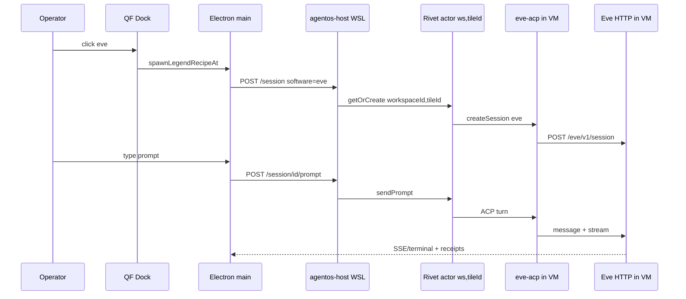

# feat: Eve as first AgentOS dock actor

## Goal Capsule

**Objective:** Ship `eve` as the first verified dock actor by packaging `quantflow-eve` as AgentOS custom software, registering it on the WSL host, and proving single-tile reply, multi-tile spawn, and cable A2A — then promoting `"eve"` into `DOCK_SPAWN_ACTOR_IDS`.

**Authority:** `docs/v7/DOCK_RUNTIME_REWORK_SPEC.md` (P2 Eve Through AgentOS, Path B), `docs/v7/AGENTOS_RIVET_RUNTIME_FINDINGS.md` §6, operator direction (Eve first; pi-stick/Hermes deferred).

**Stop conditions:** Do not promote to dock until **live** canvas proof passes (`QF_AGENTOS_SIM` is CI plumbing only — never the promotion gate). Do not add AgentOS bindings for A2A in this plan (relay first). Do not migrate `bovada-odds` / `canvas-scout` Eve personas in this plan. U6 (cable A2A) is required before U7 — promoting Eve without A2A proven would ship an actor that cannot do the product's defining verb.

**Checkpoint (after U3):** Land U1–U3, then run a bare manual proof (`POST /session` with `software:"eve"` → prompt → reply via host HTTP) **before** writing U4+ proof scripts. Discovery-then-build rhythm from P1e.

---

## Product Contract

### Summary

QuantFlow's `eve` dock card currently spawns `npm run dev` per tile on Windows PTY, which causes port-in-use failures on the second spawn. The product fix is **Eve inside AgentOS**: one Rivet actor per `[workspaceId, tileId]`, Eve running as custom ACP software inside each VM, delivery through the existing AgentOS harness and terminal bridge. Multi-tile and A2A follow naturally from per-tile actor keys.

### Problem Frame

- `quantflow-eve` agent exists with OpenCode Go provider (`agent/agent.ts`).
- `tools/agentos-host/host.js` already registers `agentOS({ software: [pi, opencode, claudeCode] })` with keyed `getOrCreate([workspaceId, tileId])`.
- `eve` launch profile is still `windows-pty` + `npm run dev` + `SERVER_AGENT_ADAPTER` — wrong rail for multi-spawn.
- `src/harness/eve/index.ts` is a **standalone HTTP client** to `127.0.0.1:3000`; useful for CI/kill-switch, not the dock product path once Eve is in AgentOS.
- `DOCK_SPAWN_ACTOR_IDS` is empty (verified-only gate).

### Requirements

| ID | Requirement |
| --- | --- |
| R1 | Package `quantflow-eve` as AgentOS custom software (ACP) buildable via `agentos-toolchain pack --agent`. |
| R2 | Register Eve software on `tools/agentos-host/host.js` and resolve `software: "eve"` in `resolveSessionConfig`. |
| R3 | Flip `eve` dock launch profile to `runtimeTarget: agentos`, `harnessKind: agentos`, `agentosSoftware: "eve"`. |
| R4 | Single-tile proof: dock spawn → AgentOS session → terminal output → Kernel `agent.reply` (or equivalent milestone) receipt. |
| R5 | Multi-spawn proof: two `eve` tiles with distinct `[workspaceId, tileId]` keys spawn without port conflict; both accept a prompt. |
| R6 | A2A proof: cable relay between two Eve AgentOS tiles produces observable ack on receiver (relay path; bindings deferred). |
| R7 | After proof, add `"eve"` to `DOCK_SPAWN_ACTOR_IDS` and sync dock UI seed tests. |

### Actors

| ID | Actor |
| --- | --- |
| A1 | Operator — clicks dock, types in terminal, connects cables |
| A2 | QuantFlow Kernel — tiles, workers, receipts (truth) |
| A3 | AgentOS host (WSL) — Rivet actor + Eve ACP session per tile |
| A4 | `quantflow-eve` agent — instructions, tools, OpenCode provider |

### Key Flows

| ID | Flow |
| --- | --- |
| F1 | App boot → prewarm AgentOS host (existing) → ready before first dock click |
| F2 | Dock click `eve` → Kernel tile + worker → `createSession("eve")` on keyed actor → terminal bridge |
| F3 | Operator prompt → ACP turn → Eve reply in tile → harness posts progress receipts |
| F4 | Second dock click `eve` → second actor key → second session (no Windows port fight) |
| F5 | Cable A → B → relay dispatcher → prompt on B session → ack visible in relay log / tile |

### Acceptance Examples

| ID | Example |
| --- | --- |
| AE1 | Click Eve on empty dock; tile appears; terminal shows session attach; one short prompt returns visible reply within readiness budget. |
| AE2 | Kernel receipt chain for that tile includes `agent.reply` (or documented milestone equivalent) before turn complete. |
| AE3 | Spawn two Eve tiles; both reach ready state; neither logs EADDRINUSE / serve-in-use. |
| AE4 | Draw cable between two Eve tiles; send from A; B tile receives relayed text and responds or acks per existing A2A proof pattern. |

### Scope Boundaries

**In scope:** Eve main dock card only; ACP package; host registration; launch profile flip; proofs; dock promotion; QA updates for eve-on-agentos rail.

**Out of scope:** pi-stick; repo `hermes` card; Nous Hermes harness; AgentOS bindings for A2A; `bovada-odds` / `canvas-scout` migration; Rivet workflow actor; deleting `src/harness/eve` (keep for kill-switch until follow-up).

### Deferred to Follow-Up Work

- AgentOS host-side bindings for structured Eve↔Eve tool calls (per [AgentOS A2A docs](https://agentos-sdk.dev/docs/agent-to-agent/)).
- Retire standalone `eve-harness` HTTP path for dock once AgentOS path is default.
- Promote additional Eve personas after main `eve` proof.

---

## Planning Contract

### Assumptions

- `agentos-toolchain` is available via `@rivet-dev/agentos` dev tooling in WSL host context (verify on first pack attempt).
- Eve can run inside AgentOS VM with `OPENCODE_GO_API_KEY` forwarded through session `env` (same key `quantflow-eve` uses today).
- ACP adapter can wrap Eve's HTTP session API (`POST /eve/v1/session`, stream NDJSON) rather than requiring a second Windows-side `eve dev`.
- Existing `agentos-terminal-bridge` + `agentos-run` receipt path is sufficient for R4; no new Kernel commands.

### Key Technical Decisions

| ID | Decision | Rationale |
| --- | --- | --- |
| KTD1 | **Path B only** — Eve as AgentOS custom software, not standalone `eve-harness` for dock | Operator intent + `DOCK_RUNTIME_REWORK_SPEC` P2; fixes multi-spawn via per-VM isolation |
| KTD2 | **ACP adapter shape:** thin bridge process inside VM speaks ACP on stdio; starts Eve HTTP server on loopback inside VM; maps ACP prompts ↔ Eve sessions | Matches [custom agents](https://agentos-sdk.dev/docs/agents/custom/) adapter pattern; Eve has no native ACP |
| KTD3 | **Software id `"eve"`** for `createSession` and `agentosSoftware` | Aligns with dock card id; extend `AgentOsSoftware` union |
| KTD4 | **Package lives in `quantflow-eve`** (versioned git repo at `5b69091+`); adapter committed **before** U2 lands in QuantFlow | Host must never depend on an uncommitted sibling build |
| KTD5 | **Per-tile Rivet key unchanged** `[workspaceId, tileId]` | Already shipped; each tile gets isolated VM → no port collision |
| KTD6 | **A2A via existing cable relay** (`tile-relay-dispatcher` → AgentOS prompt), not bindings | 0.2.7 rejects JS `toolKits`; relay is the only lane |
| KTD7 | **Prewarm host on app open** (default on) before dock clicks | Operator requirement; avoids cold WSL on first spawn |
| KTD8 | **`eve build` at pack time; `eve start` inside VM** (not `eve dev`) | Dev mode runs watchers — per-tile CPU burn; VM fs is read-mostly at runtime; `start` on prebuilt app = faster deterministic boot |
| KTD9 | **Package resolution:** `QUANTFLOW_EVE_AGENTOS_PKG` env override for dev; documented version pin for prod | Resolves OQ2; no copy-into-host without pin |
| KTD10 | **Credentials via env only** — adapter never writes `OPENCODE_GO_API_KEY` **value** into durable VM filesystem | Actor fs is durable; env-var name references only (pi `models.json` pattern) |

### High-Level Technical Design

**Multi-spawn:** Tile A → actor key `[ws, tileA]`; Tile B → `[ws, tileB]`. Each VM runs its own loopback Eve server — no shared Windows `:3000`.

### Alternative Approaches Considered

| Approach | Verdict |
| --- | --- |
| Keep `eve-harness` + one shared `eve dev` on Windows | Rejected — fights product goal (Eve in AgentOS); single port bottleneck |
| Run `npm run dev` per tile on Windows PTY | Rejected — current broken path |
| AgentOS bindings for A2A now | Deferred — relay proof sufficient for first gate |

### Risks and Dependencies

| Risk | Mitigation |
| --- | --- |
| `agentos-toolchain pack` friction / missing deps in WSL | Spike U1 early; document exact install in `tools/agentos-host/AGENTS.md` |
| Eve VM bundle size / cold session latency | Measure in U1 spike; cold VM + Eve boot + provider handshake may exceed default 90s readiness — set Eve-specific readiness budget explicitly |
| ACP ↔ Eve stream mapping incomplete | Start with single-turn prompt/reply; artifact tool path second |
| Native actor rejects JS `toolKits` | Do not register bindings in host until upstream allows; relay only |
| Credential not reaching VM | Forward `OPENCODE_GO_API_KEY` explicitly in `resolveSessionConfig("eve")` |

---

## Implementation Units

### U1. Eve ACP package scaffold

**Goal:** Create packable AgentOS custom software from `quantflow-eve`.

**Requirements:** R1

**Dependencies:** None

**Files:**
- `quantflow-eve/agentos/eve-acp/` (new — adapter entry)
- `quantflow-eve/agentos/package.json` (new — `defineSoftware` export)
- `quantflow-eve/package.json` (add pack script)
- `quantflow-eve/AGENTS.md` (document AgentOS pack contract)

**Approach:**
- Implement `eve-acp` Node process: read ACP JSON-RPC on stdin, write stdout; stderr for logs.
- **Pack pipeline:** `eve build` at pack time (prebuilt app in `.aospkg`); at runtime inside VM run `eve start` on loopback (not `eve dev` — no file watchers). Fall back to `eve dev` only if `start` breaks session API.
- Proxy `POST /eve/v1/session` and NDJSON stream lines to ACP events.
- Map `write_task_artifact` tool results to ACP tool completion + `ARTIFACT_PATH` in agent message when present.
- Run `agentos-toolchain pack --agent eve-acp` to produce `dist/package.aospkg`.
- Export `defineSoftware({ packagePath })` descriptor for host import.
- **U1 spike deliverable:** measured cold-boot latency (VM wake → first reply) and recommended readiness timeout for Eve tiles.
- **Commit adapter in `quantflow-eve` before QuantFlow U2 merges** — hard gate.

**Patterns to follow:** [AgentOS custom agents](https://agentos-sdk.dev/docs/agents/custom/) pi-acp adapter shape; `@agentos-software/pi` descriptor import style in `tools/agentos-host/host.js`.

**Test scenarios:**
- Pack command exits 0 and emits `.aospkg` artifact (includes `eve build` output).
- Adapter unit test: mock Eve HTTP — ACP initialize → session prompt → `agent.reply` text in ACP response (no live LLM).
- Credential guard: adapter and pack artifacts contain no literal `OPENCODE_GO_API_KEY` value; only env var name references.

**Verification:** `node --check` on adapter; pack script documented; artifact path stable for host import.

---

### U2. Register Eve on AgentOS host

**Goal:** Host accepts `createSession("eve")` and forwards credentials.

**Requirements:** R2

**Dependencies:** U1 (**blocked** until `quantflow-eve` adapter is committed and `.aospkg` builds reproducibly)

**Files:**
- `tools/agentos-host/host.js`
- `tools/agentos-host/package.json` (pin/path to eve package if needed)
- `tools/agentos-host/AGENTS.md`
- `tools/agentos-host/host.js` tests or `bun qa/run.ts` host smoke extension

**Approach:**
- Import Eve `defineSoftware` descriptor from packed path (env `QUANTFLOW_EVE_AGENTOS_PKG` or relative `../../../quantflow-eve/agentos/dist/...`).
- Add to `software: [pi, opencode, claudeCode, quantflowEve]`.
- Extend `resolveSessionConfig`: `software === "eve"` → `{ software: "eve", env: { OPENCODE_GO_API_KEY: ... } }` with explicit error if key missing.
- Ensure `resolveSessionConfig` rejects unknown software loudly (no pi fallback).

**Test scenarios:**
- `GET /health` still ok after registration.
- `POST /session` with `software: "eve"` + keyed `workspaceId`/`tileId` returns `sessionId` when credentials present.
- Missing `OPENCODE_GO_API_KEY` returns structured `SessionConfigError`.

**Verification:** `bun test src/harness/agentos` green; optional `bun qa/run.ts agentos-live` with eve software when cred present.

---

### U3. Flip eve dock launch profile to AgentOS rail

**Goal:** Dock/runtime routing uses AgentOS for `eve`, not Windows PTY.

**Requirements:** R3

**Dependencies:** U2

**Files:**
- `quantflow-electron/src/main/launch-profiles.ts`
- `quantflow-electron/src/main/role-service.ts` (`AgentOsSoftware` adds `"eve"`)
- `quantflow-electron/src/main/dock-actors.test.ts`
- `quantflow-electron/src/main/dock-split-equivalence.test.ts`
- `quantflow-electron/src/main/legend-recipes.test.ts`
- `qa/lib/actors-on-agentos.ts`

**Approach:**
- Replace `eve` profile: `runtimeTarget: "agentos"`, `harnessKind: "agentos"`, `agentosSoftware: "eve"`; remove `commandTemplate: "npm run dev"` and `SERVER_AGENT_ADAPTER`.
- Update `dockSubtitle` to `agentos · eve`.
- Fix tests that assert `eve` on `windows-pty`.

**Test scenarios:**
- `buildDockRoles()` for `eve` has `harnessKind: agentos` and `agentosSoftware: eve`.
- `dockActorToRole(getDockActor("eve"))` matches legend recipe spawn fields.
- `actors-on-agentos` qa lib expects eve on agentos rail.

**Verification:** `bun test quantflow-electron/src/main/dock-actors.test.ts` and related legend tests green.

---

### U3.5. Manual host checkpoint (before proof scripts)

**Goal:** Bare end-to-end proof that `software:"eve"` works through the host HTTP API before investing in Electron proof scripts.

**Requirements:** R2, R3 (partial — host + config only)

**Dependencies:** U3

**Approach:**
- With host running and `OPENCODE_GO_API_KEY` set: `POST /session` with `software:"eve"`, keyed `workspaceId` + `tileId`.
- `POST /session/:id/prompt` with short message; confirm non-empty reply in response.
- Record latency and any readiness-budget findings from U1 spike.
- Operator or verifier signs off before U4 begins.

**Verification:** Manual curl/log capture; no new automation required.

---

### U4. Single-tile Eve proof (scripted + canvas checklist)

**Goal:** Prove one dock spawn → reply → receipt.

**Requirements:** R4, AE1, AE2

**Dependencies:** U3.5 (manual checkpoint passed)

**Files:**
- `quantflow-electron/src/main/agentos-eve-proof.ts` (new — mirror `agentos-stick-proof.ts` with `RECIPE_ID = "eve"`)
- `quantflow-electron/scripts/proof-agentos-eve.ts` (launcher)
- `quantflow-electron/package.json` (proof script entry)
- `qa/lib/agentos-eve.ts` (new qa gate)
- `qa/run.ts` (register `agentos-eve` check)
- `docs/v7/P1D_PROOF_CHECKLIST.md` (append Eve evidence section if applicable)

**Approach:**
- Scripted proof: spawn `eve` tile via `spawnDockRecipeTile`, wait for agentos attach, send short prompt (`Reply with exactly: eve-proof-ok`), assert reply text + Kernel receipt milestone via existing bridge hooks.
- Support `QF_AGENTOS_SIM=1` for CI plumbing only (wiring regression) — **not** sufficient for U7 promotion.
- Document manual canvas checklist for operator sign-off before dock promotion.

**Execution note:** Live path with real `OPENCODE_GO_API_KEY` is the promotion gate. Verifier drives U4/U6 receipts; operator alone signs U7 canvas promotion.

**Test scenarios:**
- Sim/proof script exits 0 with expected reply substring.
- Failure modes distinguish host down vs missing credential vs Eve package error (three classes per `agentos-service` pattern).

**Verification:** `bun qa/run.ts agentos-eve` (new); manual P1d receipt query on live run.

---

### U5. Multi-spawn proof

**Goal:** Two Eve tiles, two actor keys, no port conflict.

**Requirements:** R5, AE3

**Dependencies:** U4

**Files:**
- `quantflow-electron/src/main/agentos-eve-multispawn-proof.ts` (new)
- `qa/lib/agentos-eve-multispawn.ts`

**Approach:**
- Spawn two `eve` tiles with distinct positions; parallel `prepare` or sequential with overlap.
- Assert both reach attach ready; send different prompts; verify distinct `actorKey` / `sessionId` in attach metadata.
- Explicitly fail if second spawn errors with address-in-use or serve-in-use strings.

**Test scenarios:**
- Two tiles spawned; both return non-empty reply.
- Worker list shows two tiles with `runtimeTarget: agentos` and different `tileId`s.
- No EADDRINUSE in host logs within proof window.

**Verification:** Proof script exit 0; optional screenshot evidence under `docs/v7/reports/evidence/`.

---

### U6. Eve A2A cable relay proof

**Goal:** Cable between two Eve AgentOS tiles delivers message and ack.

**Requirements:** R6, AE4

**Dependencies:** U5

**Files:**
- `quantflow-electron/src/main/agentos-eve-a2a-proof.ts` (rewrite or add `eve` variant — today uses `bovada-odds`/`canvas-scout`)
- `qa/lib/agentos-eve-a2a.ts`
- `quantflow-electron/src/main/agentos-a2a-relay.ts` (verify eve software routing)

**Approach:**
- Spawn two `eve` tiles; connect cable; `sendConnectionRelay` from A with test message.
- Assert relay log contains ack from B (pattern from existing `agentos-a2a-proof.ts`).
- Use AgentOS prompt path on receiver, not eve-harness HTTP.

**Test scenarios:**
- Relay returns `ok: true` with target tile B.
- String log contains `ack:` from scout/receiver tile within timeout.
- Covers F5 end-to-end.

**Verification:** `bun qa/run.ts agentos-eve-a2a` or extend existing a2a qa; proof screenshot.

---

### U7. Promote eve to verified dock

**Goal:** Eve visible on dock after proof.

**Requirements:** R7

**Dependencies:** U6 + operator canvas sign-off

**Files:**
- `quantflow-electron/src/main/dock-catalog.ts` (`DOCK_SPAWN_ACTOR_IDS`)
- `quantflow-electron/src/windows/shell/src/legend-dock.js` (sync `LEGEND_RECIPES` seed if needed)
- `quantflow-electron/src/main/dock-legend-seed-sync.test.ts`
- `quantflow-electron/src/windows/shell/src/legend-dock.test.ts`
- `docs/v7/V7_FIRST_PROOF.md` (note Eve supersedes pi-stick as first proof for operator track)

**Approach:**
- Set `DOCK_SPAWN_ACTOR_IDS = ["eve"] as const` (only after U4–U6 evidence captured).
- Update empty-state dock tests to expect one recipe button.
- DOX pass on `tools/agentos-host/AGENTS.md`, `src/harness/agentos/AGENTS.md`, nearest `dock-catalog` comments.

**Test scenarios:**
- `buildDockLegendRecipes()` ids equal `["eve"]`.
- `LEGEND_RECIPES` seed sync test passes.
- Dock HTML renders Eve card with readiness badge hook.

**Verification:** Full dock spawn manual smoke; regression `bun test` on dock-legend tests.

---

## Verification Contract

| Gate | Command / action | When |
| --- | --- | --- |
| Host unit | `bun test src/harness/agentos` | After U2 |
| Dock unit | `bun test quantflow-electron/src/main/dock-actors.test.ts quantflow-electron/src/main/dock-legend-seed-sync.test.ts` | After U3 |
| Manual checkpoint | Host `POST /session` + prompt → reply (live credential) | After U3, before U4 |
| Eve single | `bun qa/run.ts agentos-eve` | After U4 |
| Multi-spawn | `bun qa/run.ts agentos-eve-multispawn` | After U5 |
| A2A | `bun qa/run.ts agentos-eve-a2a` | After U6 |
| Fence | `bun qa/run.ts runtime-fence kill-switch` | Before promotion |
| Live | Operator canvas run + Kernel receipt query | Before U7 |

---

## Definition of Done

- [ ] `quantflow-eve` builds AgentOS `.aospkg` and host registers `software: "eve"`.
- [ ] `eve` launch profile is AgentOS-only (no per-tile `npm run dev` on Windows).
- [ ] Single-tile, multi-spawn, and A2A proofs captured (script + operator sign-off for live).
- [ ] `"eve"` in `DOCK_SPAWN_ACTOR_IDS`; dock shows one verified agent card.
- [ ] QA gates registered; DOX updated on touched AGENTS.md files.
- [ ] No Kernel truth bypass; receipts via existing AgentOS harness path only.

---

## Open Questions

| ID | Question | Status |
| --- | --- | --- |
| OQ1 | Inside VM: `eve start` vs `eve dev`? | **Resolved (KTD8):** `eve build` at pack; `eve start` in VM; `eve dev` fallback only if start breaks API |
| OQ2 | Package path resolution? | **Resolved (KTD9):** env override dev; documented pin prod |
| OQ3 | Retire `src/harness/eve` from kill-switch after AgentOS path ships? | **Deferred** — follow-up chunk |

---

## Sources and Research

- [Vercel Eve docs](https://vercel.com/docs/eve) — session API, durable sessions, filesystem-first agent
- [AgentOS custom agents](https://agentos-sdk.dev/docs/agents/custom/) — ACP packaging, `defineSoftware`, `pack --agent`
- [Rivet actor configuration](https://rivet.dev/docs/general/actor-configuration/) — sleep/wake, per-actor options
- `docs/v7/DOCK_RUNTIME_REWORK_SPEC.md` — P2, Path B, preferred stack shape
- `tools/agentos-host/host.js` — incumbent host registration pattern
- `quantflow-electron/src/main/agentos-stick-proof.ts` — proof script template (swap recipe id)
