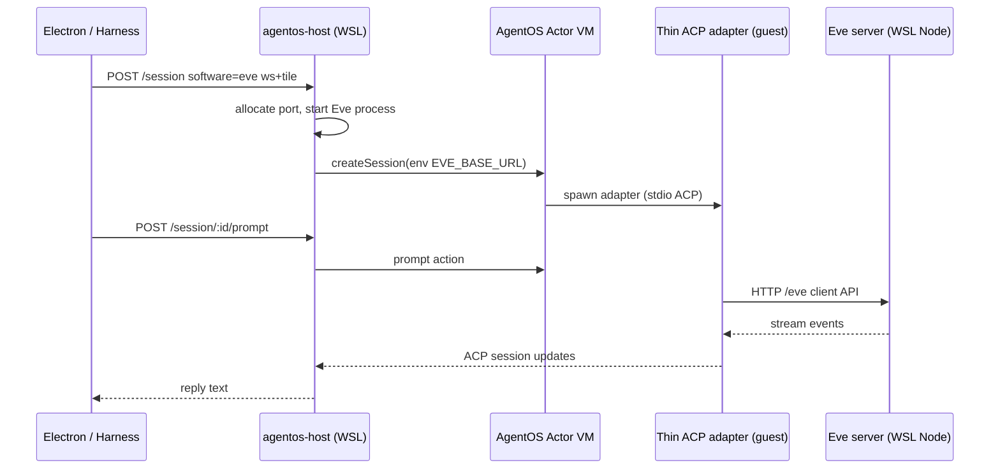

# feat: Eve AgentOS Path A — host-side Eve + thin ACP relay

**Target repos:** `QuantFlow` (branch `quantflow-v7-agentos-anchor`) + `quantflow-eve` (commit before QuantFlow when package changes)

**Supersedes:** Path B guest-bundled Eve in `docs/plans/2026-07-10-001-feat-eve-agentos-dock-actor-plan.md` — U1–U3 remain done; U3.5 onward pivots here.

**Product Contract preservation:** R1–R7 unchanged in intent; R2 implementation path changed from guest-bundled Eve to host-side Eve + thin guest relay (operator-approved Option A, 2026-07-11).

---

## Goal Capsule

Ship Eve as the first **verified** AgentOS dock actor using **Path A**: one Rivet/AgentOS actor per `[workspaceId, tileId]`, a **thin ACP adapter** inside the AgentOS guest, and **Eve running on real Node (WSL)** supervised by the host — not packed into the secure-exec guest. Complete **U3.5 live probe** through **U6** proofs with live credential; **stop before U7** dock promotion (`DOCK_SPAWN_ACTOR_IDS` stays `[]` until operator sign-off).

---

## Summary

U3.5 failed because Eve (Nitro/workflow/`node:vm`) cannot run inside AgentOS 0.2.7's restricted guest. Operator adopted **Option A**: keep the actor/session model; move Eve's brain to WSL host processes; slim the `.aospkg` to an ACP↔HTTP relay only. The host allocates a per-actor port, starts Eve from the `quantflow-eve` checkout, injects `EVE_BASE_URL` into the VM session env, and the guest adapter forwards prompts to that URL. U4–U6 reuse the original plan's proof shape (single tile, multi-spawn, A2A relay) with updated readiness gates.

---

## Problem Frame

QuantFlow needs Eve on the AgentOS rail as the first dock actor candidate. Path B (full Eve inside guest) hit ten cumulative guest restrictions; the last (`crypto.subtle` inside Eve's workflow `node:vm` sandbox) is unbounded to patch. Without a pivot, U3.5–U6 cannot pass and dock promotion is blocked.

Path A matches `docs/v7/DOCK_RUNTIME_REWORK_SPEC.md` § "Path A: Eve service adapter" and preserves canvas/harness semantics: `software:"eve"`, keyed actors, HTTP/SSE wire protocol unchanged.

---

## Requirements

| ID | Requirement |
| --- | --- |
| R1 | Eve exposes an ACP adapter package buildable as `.aospkg` and testable without Electron. |
| R2 | `tools/agentos-host` registers `software:"eve"`; session create requires keyed `workspaceId` + `tileId`. |
| R3 | Eve launch profile uses AgentOS rail; dock spawn list stays empty until U7. |
| R4 | Single-tile proof: dock recipe → AgentOS attach → prompt → reply + receipt milestone. |
| R5 | Two concurrent Eve tiles: distinct actor keys, no port collision. |
| R6 | A2A cable between two Eve tiles delivers message and ack via AgentOS relay. |
| R7 | Promote `eve` to `DOCK_SPAWN_ACTOR_IDS` only after U6 + operator canvas sign-off (**out of scope for this goal**). |

**Actors:** Operator (U7 sign-off only), AgentOS host (WSL), Eve server (WSL Node), QuantFlow harness/Electron proofs.

**Key flows:** F1 host session create → F2 prompt round-trip → F3 canvas tile spawn → F4 multi-actor → F5 A2A relay.

**Acceptance examples:** AE1 single reply `eve-proof-ok`; AE2 receipt milestone; AE3 two tiles both reply; AE4 A2A ack.

---

## Key Technical Decisions

| ID | Decision | Rationale |
| --- | --- | --- |
| KTD1 | **Path A only** — no guest Eve spawn, no AST patching, no `patch-agentos-package.mjs` | Guest is WASM/restricted; spiral rejected by review and operator. |
| KTD2 | **Host supervises Eve** per compound actor key `[workspaceId, tileId]` | Matches durable actor address; Eve needs real Node 24 + full filesystem. |
| KTD3 | **Deterministic port allocation** from actor key (e.g. `3010 + stableHash % 900`) with collision retry | U5 requires two simultaneous Eve processes; avoid manual ports. |
| KTD4 | **Slim `.aospkg`** — ACP SDK + HTTP relay only; Eve deps run from WSL checkout | Shrinks guest surface; U1 cold probe was ~4.5s on Windows Node — guest boot budget stays tight. |
| KTD5 | **Session env injection:** host sets `EVE_BASE_URL` (and credential aliases) before guest adapter starts | Guest reaches host loopback via `network:allow`; adapter reads URL, does not spawn. |
| KTD6 | **Eve checkout path** via `QUANTFLOW_EVE_ROOT` (default sibling `../../../quantflow-eve`) | Host already resolves `.aospkg` path similarly. |
| KTD7 | **Live credential required** for U3.5/U4–U6 promotion; `QF_AGENTOS_SIM=1` wiring-only | Sim never substitutes for promotion gate (unchanged from origin plan). |
| KTD8 | **Probes run inside WSL** against `127.0.0.1:7430` | Windows curl to WSL host hung in prior session. |
| KTD9 | **Commit order:** `quantflow-eve` first when package changes, then QuantFlow | Host pins `.aospkg` from eve dist. |

---

## High-Level Technical Design



**Lifecycle:** Host `eve-supervisor` map keyed by `actorKey` holds `{ port, pid, baseUrl, startedAt }`. On first `software:"eve"` session for that key, supervisor starts Eve (`node` entry or `npm run dev` with `PORT`). On actor idle teardown or `/dispose`, stop Eve and release port. Guest adapter: `initialize`/`newSession` immediate; `prompt` awaits HTTP health then streams via existing `EveAcpAgent` event mapping (reuse committed logic, drop in-guest `spawn`).

**State machine (supervisor):**

```text
missing → starting → ready → stopping → missing
  ↑ starting fails → error (surface to session create)
```

---

## Output Structure

```text
quantflow-eve/
  agentos/eve-acp/
    index.js              # thin relay (no guest spawn)
    relay-client.js       # HTTP to EVE_BASE_URL (optional extract)
    index.test.js
    eve-start.mjs         # KEEP: Node preflight only if host spawn uses it
  agentos/dist/package.aospkg   # slim artifact

QuantFlow/
  tools/agentos-host/
    eve-supervisor.js     # per-actor Eve process manager
    eve-supervisor.test.mjs
    host.js               # hook supervisor on eve sessions
    u35-probe.sh          # unchanged contract
  quantflow-electron/src/main/
    agentos-eve-proof.ts
    agentos-eve-multispawn-proof.ts
    agentos-eve-a2a-proof.ts
  qa/lib/
    agentos-eve.ts
    agentos-eve-multispawn.ts
    agentos-eve-a2a.ts
```

---

## Scope Boundaries

**In scope:** Reset eve spiral; slim package; host supervisor; U3.5–U6 live proofs; qa gates; DOX updates; optional upstream Rivet issue draft (non-blocking).

**Out of scope:** U7 dock promotion; Rivet TileActor supervisor; AgentOS bindings/toolKits; guest restriction patching; `QF_AGENTOS_SIM` as promotion proof.

### Deferred to Follow-Up Work

- U7 — add `eve` to `DOCK_SPAWN_ACTOR_IDS` after operator sign-off
- Path B revisit if AgentOS ships full Linux sandbox mount
- Upstream Rivet issue filing (parallel, not blocking U3.5)

### Deferred for later

- Eve vault mirror, Conductor deliver, harness `eve-harness` retirement

---

## Assumptions

- WSL is healthy; `OPENCODE_API_KEY` or `OPENCODE_GO_API_KEY` present in WSL profile
- `quantflow-eve` sibling checkout at default relative path
- Node 24+ available in WSL for Eve server
- AgentOS 0.2.7 guest can HTTP to `127.0.0.1:<host-port>` with existing `network:allow`

---

## Implementation Units

### U1. Reset spiral and slim Eve ACP package

**Goal:** Discard uncommitted guest-patch work; ship a small `.aospkg` that only relays ACP to `EVE_BASE_URL`.

**Requirements:** R1

**Dependencies:** none (replaces failed Path B packaging)

**Files:**
- `quantflow-eve/agentos/eve-acp/index.js`
- `quantflow-eve/agentos/eve-acp/index.test.js`
- `quantflow-eve/agentos/eve-acp/package.json` (if split deps)
- `quantflow-eve/package.json` (`pack:agentos`, files allowlist)
- `quantflow-eve/agentos/scripts/` — **delete** `patch-agentos-package.mjs` if present

**Approach:**
- `git checkout` / restore committed base; remove uncommitted shim/patch/diagnostic files
- Remove in-guest `spawn` of Eve server; adapter requires `process.env.EVE_BASE_URL` (throw loud if missing)
- Reuse `EveAcpAgent` prompt/event translation against HTTP client pointed at `EVE_BASE_URL`
- `pack:agentos` produces slim tarball (target ≪ 59MB — adapter + acp sdk only)
- Keep `eve-start.mjs` only if host spawn reuses it; do not bundle Nitro output into guest package

**Execution note:** Prefer smoke-first — `npm run pack:agentos` then list tarball contents to confirm no `.output`/workflow bundle inside guest package.

**Patterns to follow:** Committed `index.js` ACP event mapping; existing `index.test.js` patterns

**Test scenarios:**
- Unit: adapter `initialize` returns agentInfo without spawning child process
- Unit: `prompt` with mock HTTP server returns expected text update
- Unit: missing `EVE_BASE_URL` throws clear error at first prompt
- Pack: tarball excludes `node_modules/eve` engine bundle and `.output` server artifacts

**Verification:** `npm run test:agentos` pass; `npm run pack:agentos` produces `.aospkg`; commit `quantflow-eve` before QuantFlow host pin update

---

### U2. Host Eve supervisor per actor key

**Goal:** Host starts/stops real Eve on WSL per `[workspaceId, tileId]` and injects `EVE_BASE_URL` into session env.

**Requirements:** R2

**Dependencies:** U1

**Files:**
- `tools/agentos-host/eve-supervisor.js` (new)
- `tools/agentos-host/eve-supervisor.test.mjs` (new)
- `tools/agentos-host/host.js`
- `tools/agentos-host/host-config.test.mjs`
- `tools/agentos-host/AGENTS.md`

**Approach:**
- `ensureEveForActorKey({ workspaceId, tileId })` → `{ baseUrl, port }`
- Port formula: `EVE_PORT_BASE` (default 3010) + stable hash mod range; retry on `EADDRINUSE`
- Spawn: `node <eve-root>/...` or documented `npm run dev` with `PORT` and credential env forwarded (reuse `resolveOpencodeKey()` alias behavior from U3.5a)
- Hook on `software === "eve"` session path **before** actor prompt: call supervisor, merge `EVE_BASE_URL` + credential vars into VM session env
- Stop Eve on session dispose / actor key eviction / host `/dispose`
- Log `cold_boot_ms` boundary at Eve health-ready (for U3.5 receipt)

**Patterns to follow:** `host-lifecycle.ts` patterns; existing `resolveQuantflowEvePackagePath()`; pi session env credential order in `host.js`

**Test scenarios:**
- Two distinct actor keys get different ports
- Second call for same key returns same `baseUrl` without second spawn
- Spawn failure surfaces non-200 session create with actionable message
- Supervisor releases port after `stopEveForActorKey`
- `host-config.test.mjs`: eve software still registered; env alias tests still pass

**Verification:** `node --check host.js`; `node --test host-config.test.mjs`; `node --test eve-supervisor.test.mjs`

---

### U3. U3.5 live probe receipt

**Goal:** Pass `tools/agentos-host/u35-probe.sh` from **inside WSL** with reply containing `eve-u35-live-ok`.

**Requirements:** R2 (live gate)

**Dependencies:** U2

**Files:**
- `tools/agentos-host/u35-probe.sh` (verify only)
- `docs/goals/eve-agentos-dock-u35-u6/state.yaml` (receipt update)
- `docs/v7/reports/` (optional probe log artifact)

**Approach:**
- Restart isolated host after package + supervisor land
- Run `u35-probe.sh` from **inside WSL** with cwd `tools/agentos-host` (not from Windows — prior session hung on cross-boundary health checks)
- Record `cold_boot_ms`, `prompt_ms`, session JSON in goal receipt T003
- Update goal status from `blocked_on_operator` → active for T004

**Execution note:** Live credential required; do not use `QF_AGENTOS_SIM`.

**Test scenarios:**
- Covers F1/AE1 partial: health `hasCredential: true`
- Prompt response contains exact substring `eve-u35-live-ok`
- Probe exit 0

**Verification:** `u35-probe.sh` exit 0; receipt filed in goal state

---

### U4. Single-tile Eve proof

**Goal:** Scripted proof: spawn `eve` dock recipe tile → AgentOS attach → prompt → reply.

**Requirements:** R4, AE1, AE2

**Dependencies:** U3

**Files:**
- `quantflow-electron/src/main/agentos-eve-proof.ts` (new)
- `quantflow-electron/scripts/proof-agentos-eve.ts` (new)
- `quantflow-electron/package.json`
- `qa/lib/agentos-eve.ts` (new)
- `qa/run.ts`
- `docs/v7/P1D_PROOF_CHECKLIST.md` (append Eve section)

**Approach:** Mirror `agentos-stick-proof.ts` with `RECIPE_ID = "eve"`; prompt `Reply with exactly: eve-proof-ok`; assert AgentOS rail tile; use terminal bridge attach/prompt; save evidence screenshot optional.

**Patterns to follow:** `quantflow-electron/src/main/agentos-stick-proof.ts`

**Test scenarios:**
- Covers AE1: reply contains `eve-proof-ok`
- Covers AE2: Kernel receipt or milestone logged (per stick proof pattern)
- Failure classes: host down, missing credential, Eve supervisor error (three distinct messages)
- Sim mode: qa gate passes wiring with `QF_AGENTOS_SIM=1` (non-promotion)

**Verification:** `bun qa/run.ts agentos-eve` (live path documented in qa lib)

---

### U5. Multi-spawn proof

**Goal:** Two Eve tiles concurrently — distinct `actorKey` / `sessionId`, no `EADDRINUSE`.

**Requirements:** R5, AE3

**Dependencies:** U4

**Files:**
- `quantflow-electron/src/main/agentos-eve-multispawn-proof.ts` (new)
- `qa/lib/agentos-eve-multispawn.ts` (new)
- `qa/run.ts`

**Approach:** Spawn two `eve` tiles; distinct prompts; assert both attach ready; grep host logs for port collision strings → fail.

**Test scenarios:**
- Covers AE3: both tiles non-empty replies
- Worker list shows two `tileId`s with agentos runtime
- Parallel spawn does not error with address-in-use

**Verification:** `bun qa/run.ts agentos-eve-multispawn` live exit 0

---

### U6. Eve A2A cable relay proof

**Goal:** Cable between two Eve tiles delivers message and ack via AgentOS relay.

**Requirements:** R6, AE4, F5

**Dependencies:** U5

**Files:**
- `quantflow-electron/src/main/agentos-eve-a2a-proof.ts` (new)
- `qa/lib/agentos-eve-a2a.ts` (new)
- `quantflow-electron/src/main/agentos-a2a-relay.ts` (verify `software:"eve"` routing only)
- `qa/run.ts`

**Approach:** Follow `agentos-a2a-proof.ts` shape with two `eve` tiles; `sendConnectionRelay`; assert ack in relay log within timeout. Relay only — no AgentOS toolKits.

**Test scenarios:**
- Covers AE4 / F5: relay `ok: true`, log contains `ack:` from receiver tile
- Wrong software route fails loudly (regression guard)

**Verification:** `bun qa/run.ts agentos-eve-a2a` live exit 0

---

### U8. DOX and plan cross-links

**Goal:** AGENTS/docs reflect Path A; old plan annotated superseded.

**Requirements:** traceability

**Dependencies:** U6

**Files:**
- `tools/agentos-host/AGENTS.md`
- `src/harness/agentos/AGENTS.md`
- `quantflow-eve/agentos/README.md` (if exists, else create minimal)
- `docs/plans/2026-07-10-001-feat-eve-agentos-dock-actor-plan.md` (add superseded-by header note)
- `docs/goals/eve-agentos-dock-u35-u6/state.yaml`

**Approach:** Document Path A supervisor, env vars (`EVE_BASE_URL`, `QUANTFLOW_EVE_ROOT`, `EVE_PORT_BASE`), probe location (WSL), explicit "no guest Eve" rule.

**Test expectation:** none — documentation only

**Verification:** DOX chain re-read; no contradictory Path B instructions remain in host harness docs

---

## Verification Contract

Run from repo root `QuantFlow` unless noted.

| Gate | When | Command / outcome |
| --- | --- | --- |
| V1 | After U1 | `quantflow-eve`: `npm run test:agentos && npm run pack:agentos` |
| V2 | After U2 | `node --test tools/agentos-host/eve-supervisor.test.mjs` + `host-config.test.mjs` |
| V3 | After U3 | WSL: `tools/agentos-host/u35-probe.sh` → `U3.5 PASS` |
| V4 | After U4 | `bun qa/run.ts agentos-eve` (live) |
| V5 | After U5 | `bun qa/run.ts agentos-eve-multispawn` (live) |
| V6 | After U6 | `bun qa/run.ts agentos-eve-a2a` (live) |
| V7 | Cumulative | `bun test src/harness/agentos` |
| V8 | Cumulative | `bun qa/run.ts agentos-atom` |
| V9 | Cumulative | `bun qa/run.ts runtime-fence` |
| V10 | Cumulative | `bun qa/run.ts kill-switch` |

**Regression guard:** V7–V10 must pass before goal complete. Live gates V3–V6 require WSL host + credential; skip is not pass.

---

## Definition of Done

- [ ] `quantflow-eve` spiral discarded; slim `.aospkg` committed
- [ ] Host `eve-supervisor` manages per-actor Eve on WSL; `EVE_BASE_URL` injected
- [ ] U3.5 probe passes with `eve-u35-live-ok` (receipt with timings)
- [ ] U4–U6 live proof scripts + qa gates pass
- [ ] V7–V10 regression stack green
- [ ] DOX updated for Path A
- [ ] `DOCK_SPAWN_ACTOR_IDS` still `[]` — **U7 not executed**
- [ ] Goal `eve-agentos-dock-u35-u6` judge receipt: `complete`, `full_outcome_complete: true` (U3.5–U6 only)

---

## Risks & Dependencies

| Risk | Mitigation |
| --- | --- |
| Guest cannot reach host loopback | Verify with minimal HTTP ping in adapter first prompt; widen `network:allow` only if proven necessary |
| Eve cold start exceeds probe timeout | Supervisor health poll with configurable budget; log `cold_boot_ms`; extend u35 curl max-time only if measured |
| Port exhaustion under many tiles | Document `EVE_PORT_RANGE`; fail loud; U5 proves two concurrent |
| WSL wedged | Document restart procedure; probes must run in WSL bash |
| Stale `.aospkg` pin | Commit eve before QuantFlow; restart host after pack |

**Prerequisites:** U1–U3 from origin plan (ACP package exists, host registers eve, launch profile flipped, credential alias fix `a928586`).

---

## Alternative Approaches Considered

| Alt | Why not now |
| --- | --- |
| Path B guest bundle | Failed U3.5; restriction #10 unbounded |
| AgentOS Linux sandbox mount | Unclear 0.2.7 support; higher integration risk |
| Drop AgentOS for Eve | Breaks dock-actor architecture and harness contract |

---

## Open Questions

| Q | Status |
| --- | --- |
| Exact Eve host entry command (`node .output/server` vs `eve start`) | Resolve in U2 implementation — prefer stable documented dev entry |
| Whether guest needs `host.docker.internal`-style alias vs `127.0.0.1` | Defer to U3.5 probe; WSL loopback default |

---

## Sources & Research

- Operator decision Option A (conversation 2026-07-11; goal T003 receipt)
- `docs/plans/2026-07-10-001-feat-eve-agentos-dock-actor-plan.md` (U4–U7 proof shape)
- `docs/v7/DOCK_RUNTIME_REWORK_SPEC.md` Path A (lines 316–320)
- `tools/agentos-host/AGENTS.md` — actor key, credential order, 0.2.7 boundaries
- `docs/goals/eve-agentos-dock-u35-u6/state.yaml` — guest restriction inventory

---

## PR / Landing Strategy

- **quantflow-eve:** one or two commits on its default branch — U1 package reset + supervisor spawn helper if needed
- **QuantFlow:** commit per unit cluster (U2 host, U4–U6 proofs, U8 docs) on `quantflow-v7-agentos-anchor`
- Push to `origin` only; do not promote dock (U7) in any PR
- Handoff receipt: update `docs/goals/eve-agentos-dock-u35-u6/state.yaml` as units complete

---

## System-Wide Impact

- **Harness:** No change to `AgentOsTransport` contract; Eve uses same HTTP paths
- **Kernel:** Proofs post receipts via existing agentos-run path only
- **Dock:** Unchanged visibility until U7
- **CI:** New qa libs; live gates skip without credential (non-blocking CI, blocking promotion)
