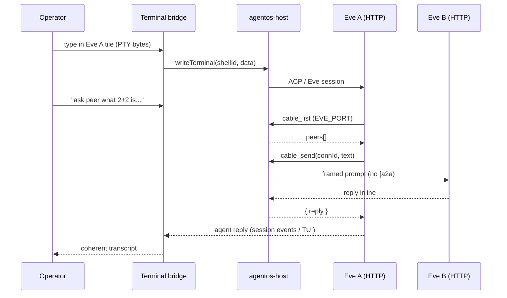

# feat: T-UX Eve — native TUI + agent-chosen cable collaboration

**Target repos:** `QuantFlow` (`quantflow-v7-agentos-anchor`) + `quantflow-eve` (tools first when contract changes).

**Product Contract preservation:** unchanged — brainstorm R1–R9, D1–D6, AE1–AE3 stand as written.

---

## Goal Capsule

**Objective:** Ship one dock product sentence for Eve on the AgentOS actor path: draw a cable, type normally in Eve's real terminal surface, ask her cabled peer a question in plain language — Eve discovers peers, sends, receives a clean reply, reports back. No `[a2a` plumbing, no phantom turns, no homemade prompt shell.

**Authority:** Founder direction (2026-07-12) + `docs/v7/DOCK_RUNTIME_REWORK_SPEC.md` + `docs/v7/AGENTOS_RIVET_RUNTIME_FINDINGS.md`. Supersedes `docs/plans/2026-07-12-001-feat-t-ux-agent-cable-comms-plan.md`. U5/U6 regression from `docs/plans/2026-07-11-001-feat-eve-agentos-path-a-adapter-plan.md` stays binding.

**Stop conditions:** Do not promote `DOCK_SPAWN_ACTOR_IDS` (U7). Builder does not commit — operator verifies.

**GO decision (founder, 2026-07-12):** the native actor `toolKits` mount is unshipped on 0.2.7 / rc / main (spike-proven: throws `unrecognized_keys`). This blocks **nothing** in the current dock goal — every product sentence is Eve↔Eve, and the Eve HTTP bridge is the documented host-bridge pattern with identical semantics. The only deferred capability is agent-initiated sends from *non-Eve* species (Pi/Claude/OpenCode), which is out of current scope anyway. Build now; the U5 tripwire flips the day Rivet ships and we mount `buildCableKit` then. We lead, CI watches.

**Two amendments to Cursor's original draft (founder calls, 2026-07-12):**
1. **`/cable` (T-UX-lite) is KEPT** as a debug/power command — it is built, gate-green (`agentos-eve-cable-chat`), and compatible. Product exit remains plain chat (AE1). `agentos-eve-cable-chat` stays in the regression stack.
2. **U1 (native TUI) is reordered to LAST and rescoped to a bounded spike** — see the amended U1 section. It must not block the cable rework (U2–U6), which is the pure-win, native-surface work.

**Build order:** U2 → U3 → U5 (host + qa, single repo, no Electron run) → U4 (`quantflow-eve`) → U6 (proof) → **U1 spike last**. U2/U3/U5 is the first Codex bite.

---

## Product Contract

### Summary

Eve dock tiles run on the correct runtime (AgentOS-backed Rivet actor per `[workspaceId, tileId]`) but the wrong display: fake ACP prompt shell garbles session events and treats cable relay metadata as shell commands. Cable transport works (U6); semantics and presentation do not.

This plan delivers real Eve terminal presentation plus agent-initiated cable collaboration driven through plain operator typing.

### Problem Frame

1. **Display** — `isAcpPromptSoftware("eve")` routes Eve through `acp-prompt-line-editor` instead of raw terminal I/O.
2. **Cable framing** — `executeCableSend` injects `[a2a tile→tile]` into peer prompts.
3. **Reply semantics** — host back-prompts sender session after relay (lines 699–707 in `host.js`).

### Requirements

| ID | Requirement |
| --- | --- |
| R1 | Eve dock tile shows native terminal interaction surface — not ACP prompt-mode fake shell. |
| R2 | Session create carries QuantFlow protocol `additionalInstructions` (identity + cable protocol; no peer lists). |
| R3 | Cable delivery: `Message from cabled agent @<label> (canvas cable): <text>`. No `[a2a` in operator-visible streams. |
| R4 | Replies inline to tool caller; host back-prompt removed. |
| R5 | Eve `cable_list` + `cable_send` via host HTTP; identity from `EVE_PORT`. |
| R6 | Plain chat only — no `/cable`, no popover for product exit. |
| R7 | Tripwire `agentos-toolkit-envelope` — green while native envelope rejects `toolKits`. |
| R8 | Scripted gate `agentos-eve-native-collab` + evidence `V7-04`. |
| R9 | `agentos-eve-multispawn` + `agentos-eve-a2a` stay green. |

### Acceptance Examples

| ID | Example |
| --- | --- |
| AE1 | Two Eves, one cable. In A: `Ask your cabled peer what 2 + 2 is and tell me their answer.` A uses cable tool; B sees clean framing; A reports 4; no `[a2a`, no phantom turns. |
| AE2 | Delete cable, repeat → A reports no peers. |
| AE3 | Tile formatting coherent — no mid-word event-chunk breaks (founder spot-check). |

### Scope Boundaries

**In scope:** Eve dock only; native TUI rail; host cable protocol; Eve tools; tripwire; proof.

**Out of scope:** `/cable` operator command; cable popover UX; pi/hermes/codex/claude; `buildCableKit` mount; U7 promotion; kernel `message.*` schema.

### Deferred to Follow-Up Work

- Mount `buildCableKit` when tripwire flips.
- Extend pattern to other dock cards.
- T-PERF warm pool polish beyond proof budget.

---

## Planning Contract

### Assumptions

- `AgentOsTransport` V1 terminal API (`openTerminal` / `writeTerminal` / `onTerminalData`) is implemented on the live host path — Eve TUI uses this, not `transport.prompt` per keystroke.
- Eve ACP adapter inside the VM can expose terminal bytes when the canvas binds PTY passthrough (verify in U1 spike; fallback is improved event projection only for Eve).
- Port identity for `cable_list`/`cable_send` comes from `eve-supervisor` `running` map (`port → keyId`), not `portForKey()` reverse hash (warm-pool adoption).

### Key Technical Decisions

| ID | Decision | Rationale |
| --- | --- | --- |
| KTD1 | **Eve exits prompt-mode.** Remove `eve` from `isAcpPromptSoftware` (or equivalent gate). Eve tiles use `writeTerminal`/`onTerminalData` only — same transport seam pi/claude would use if they were on AgentOS terminal rail. | Fixes R1/AE3 at source; `acp-prompt-line-editor.ts` is the garbage generator. |
| KTD2 | **Cable peer messages never hit operator PTY as raw prompts.** Framed text goes to Eve via ACP turn injection on the **peer session** only; operator sees formatted session-event lines if anything, never `[a2a`. | Separates operator display from agent prompt path. |
| KTD3 | **Eve tools = HTTP to host** (`QF_HOST_URL` + `EVE_PORT`). Mirrors `buildCableKit` semantics until tripwire flips. | Native envelope rejects `toolKits` on 0.2.7 (verified). |
| KTD4 | **Proof uses plain-chat prompt to Eve A**, not `sendConnectionRelay`. | R6 product sentence; relay path remains regression-only (U6). |
| KTD5 | **Commit order:** `quantflow-eve` tools first when tool files change, then QuantFlow. | Repo pairing rule. |

### High-Level Technical Design



---

## Implementation Units

### U1. Eve terminal presentation — BOUNDED SPIKE, BUILD LAST

**⚠️ Rescoped (founder, 2026-07-12).** The original "remove Eve from prompt-mode, route keystrokes via `writeTerminal`" is WRONG as a headline: `writeTerminal` writes to the **guest VM shell**, but Eve runs as an HTTP server on WSL (Path A) — there is NO Eve TUI in the guest to pass through, and the ACP line editor is Eve's ONLY input path (deleting it breaks AE1, which requires typing to Eve in her tile). So U1 is a **bounded presentation spike**, done AFTER U2–U6, and it must not gate the cable rework. Real host-side-PTY-to-Eve TUI is genuine new design → deferred to T-UX-full (with T-PERF), where the sequence already parks it.

**Goal (spike):** Determine whether Eve's ACP adapter emits real terminal bytes on `openTerminal` attach. Two landing zones, decided by the spike result:
- **If real bytes exist:** route Eve input/output through `writeTerminal`/`onTerminalData`, keep a minimal input path. (Upgrade — unlikely given Path A.)
- **If not (expected):** KEEP the ACP line editor as the input path, but improve OUTPUT presentation only — remove the `"Eve ready — type a message"` fake banner and the `> ` prompt chrome, make `acpEventToTerminalText` coalesce cleanly so Eve's replies don't break mid-word (fixes AE3). **Do not remove `createAcpPromptLineEditor` for Eve.**

**Requirements:** AE3 (R1 downgraded to "clean presentation," not "native TUI" — full TUI is T-UX-full).

**Dependencies:** U2–U6 land and stay green first. Purely additive to presentation.

**Files:**
- `quantflow-electron/src/main/acp-prompt-line-editor.ts` (banner/chrome only — do NOT drop Eve from the editor)
- `quantflow-electron/src/main/agentos-terminal-bridge.ts` (event coalescing)

**Approach:**
- Spike: attach an Eve tile, log whether `onTerminalData` yields bytes vs. only `onSessionEvent` fires. Record the answer in the unit comment.
- Expected path: kill `bootstrapAcpTerminalText`'s banner + `> ` chrome for Eve; tighten `acpEventToTerminalText` so streamed chunks render as coherent lines. Input editor unchanged.
- STOP and report if the spike suggests removing the editor is needed — that is a T-UX-full design change, not a U1 edit.

**Test scenarios:**
- Eve still accepts typed input after the change (editor intact).
- No `"Eve ready — type a message"` banner; no mid-word chunk breaks in streamed output.

**Verification:** Manual (AE3): Eve tile transcript reads coherently; typing still reaches Eve.

---

### U2. Host cable semantics (framing + inline reply + instructions)

**Goal:** Clean cable delivery and session protocol; delete sender back-prompt.

**Requirements:** R2, R3, R4

**Dependencies:** none (parallel with U1)

**Files:**
- `tools/agentos-host/host.js`
- `tools/agentos-host/quantflow-instructions.js` (new, optional extract)

**Approach:**
- At `createSession` (~1044): pass `additionalInstructions: buildQuantflowTileInstructions({ tileId, workspaceId, software })` — protocol only, ~10 lines, exported constant for proof assertions.
- In `executeCableSend` (~659): replace `[a2a …]` delegated string with `Message from cabled agent @${fromLabel} (canvas cable ${connId}): ${msg}`. Derive `fromLabel` from session record (`software` + short tile suffix); add `label` at session create if missing.
- **Delete** back-prompt block (699–707). Return `{ ok, targetTileId, reply }` to caller only.
- `QF_AGENTOS_SIM` unchanged.

**Patterns to follow:** `buildCableKit` execute shape at `host.js:732`; U6 `agentos-eve-a2a-live-proof.ts` relay expectations.

**Test scenarios:**
- Sim cable send returns reply without second `promptSession` on source.
- Framed string contains `Message from cabled agent` and excludes `[a2a`.

**Verification:** `bun qa/run.ts agentos-eve-a2a` stays green.

---

### U3. Cable discovery + port identity (host + supervisor)

**Goal:** `GET /cable/peers` and `fromPort` on `POST /cable/send`.

**Requirements:** R5 (discovery half)

**Dependencies:** U2

**Files:**
- `tools/agentos-host/host.js`
- `tools/agentos-host/eve-supervisor.js`

**Approach:**
- Export `getPortForKeyId(keyId)` / `getKeyIdForPort(port)` from supervisor `running` map (iterate entries; warm adoption keeps stored port).
- `GET /cable/peers?port=<n>` → resolve port→keyId→tileId via actor address + `hostConnectionGraph` + `tileToSession` labels.
- Response: `{ tileId, peers: [{ connectionId, peerTileId, peerLabel, peerSoftware }] }`.
- `POST /cable/send`: accept `{ fromPort, connectionId, text }`; resolve `fromTileId`. Existing `fromTileId`/`fromSessionId` callers unchanged.
- Add `QF_HOST_URL` to Eve spawn env in `eve-supervisor.js` (`http://127.0.0.1:${AGENTOS_HOST_PORT??7430}`).

**Test scenarios:**
- Unknown port → 404.
- Port with no cables → `{ peers: [] }`.
- Warm-adopted instance: same port resolves to adopted keyId.

**Verification:** Unit test on port map helper; integration via U5 proof.

---

### U4. Eve cable tools (quantflow-eve)

**Goal:** `cable_list` + `cable_send` callable by Eve agent during plain chat turns.

**Requirements:** R5, R6

**Dependencies:** U3

**Files (quantflow-eve):**
- `agent/tools/cable_list.ts` (new)
- `agent/tools/cable_send.ts` (new)

**Files (QuantFlow):**
- `tools/agentos-host/eve-supervisor.js` (env only if not done in U3)

**Approach:**
- Mirror `agent/tools/write_task_artifact.ts` `defineTool` pattern.
- `cable_list`: `GET ${QF_HOST_URL}/cable/peers?port=${EVE_PORT}`.
- `cable_send`: `POST ${QF_HOST_URL}/cable/send` body `{ fromPort: EVE_PORT, connectionId, text }` → return `{ reply }` inline.
- Tool descriptions: "requires existing canvas cable — use cable_list first".
- Register tools in Eve agent tool index (follow existing `write_task_artifact` registration path).

**Execution note:** Commit `quantflow-eve` first, then QuantFlow host env wiring.

**Test scenarios:**
- `cable_list` with no peers returns empty array (not error).
- `cable_send` without connectionId throws clear tool error.

**Verification:** Eve agent loads tools; U5 proof exercises them live.

---

### U5. Tripwire gate `agentos-toolkit-envelope`

**Goal:** CI asserts native envelope still rejects `toolKits`; inverts on upgrade.

**Requirements:** R7

**Dependencies:** none

**Files:**
- `tools/agentos-host/toolkit-envelope-probe.mjs` (exists from spike — wire into qa)
- `qa/lib/agentos-toolkit-envelope.ts` (new)
- `qa/run.ts`

**Approach:**
- Probe: `agentOS({ toolKits: [minimal kit] })` must throw `unrecognized_keys` containing `toolKits`. Exit 0 on reject; exit 1 with loud mount message on accept.
- Register `bun qa/run.ts agentos-toolkit-envelope`. No Electron.

**Test scenarios:**
- Probe exits 0 on current 0.2.7 install.

**Verification:** Gate green in CI today.

---

### U6. Scripted proof `agentos-eve-native-collab`

**Goal:** Full product sentence automated; evidence V7-04.

**Requirements:** R8, AE1

**Dependencies:** U2, U3, U4 (NOT U1 — plain-chat cable collaboration is independent of terminal presentation).

**Files:**
- `quantflow-electron/src/main/agentos-eve-native-collab-proof.ts` (new)
- `quantflow-electron/scripts/proof-agentos-eve-native-collab.ts` (new)
- `qa/lib/agentos-eve-native-collab.ts` (new)
- `quantflow-electron/src/main/index.ts`
- `quantflow-electron/package.json`
- `qa/run.ts`

**Approach:**
- Reuse `agentos-eve-proof-shared.ts` spawn/sync helpers (same as U6 a2a proof).
- Spawn Eve A + B, sync cable, **prompt A in plain chat** (not `sendConnectionRelay`): instruction contains `agent-native-collab-ok` or arithmetic variant.
- Assert:
  - A's final text includes expected peer reply token.
  - B's session events / prompted text contains `Message from cabled agent` and excludes `[a2a `.
  - Relay log has A→B and return path.
  - No second inbound prompt on B after reply (event count guard).
- Screenshot `docs/v7/reports/evidence/V7-04-agentos-eve-native-collab-live.png`.
- Env flag `QF_AGENTOS_EVE_NATIVE_COLLAB_PROOF`, timeout 480_000, `assertEveStillUnpromoted`.

**Execution note:** Proof is the Definition of Done — implement after U1–U4 land.

**Test scenarios:**
- Covers AE1 scripted subset.
- Negative: optional unit test that proof helper rejects `[a2a` in framing assertion.

**Verification:** `bun qa/run.ts agentos-eve-native-collab` green with credential.

---

## Verification Contract

**Regression stack (cumulative):**

```text
bun qa/run.ts agentos-toolkit-envelope
bun qa/run.ts agentos-eve-multispawn
bun qa/run.ts agentos-eve-a2a
bun qa/run.ts agentos-eve-cable-chat        # /cable kept as debug command (amendment 1)
bun qa/run.ts agentos-eve-native-collab
```

**Founder manual (authoritative exit):**

1. Spawn Eve A + B, cable A↔B.
2. In A's tile: `Ask your cabled peer what 2 + 2 is and tell me their answer.`
3. Pass AE1 + AE3.
4. Delete cable, repeat → AE2.

**Evidence:** `docs/v7/reports/evidence/V7-04-agentos-eve-native-collab-live.png`

---

## Definition of Done

- [ ] U1–U6 complete; Product Contract R1–R9 satisfied.
- [ ] Regression stack green.
- [ ] Founder manual AE1–AE3 pass.
- [ ] `DOCK_SPAWN_ACTOR_IDS` unchanged.
- [ ] No T-UX-lite `/cable` paths required for exit.
- [ ] Operator holds verification; builder leaves uncommitted changes unless operator authorizes commit.

---

## Risks & Dependencies

| Risk | Mitigation |
| --- | --- |
| Eve ACP adapter lacks terminal bytes on `openTerminal` | U1 spike; fallback coalescer without fake shell |
| Warm-pool port ≠ `portForKey` hash | U3 uses supervisor `running` map only |
| LLM may not invoke cable tool from plain chat | Proof uses deterministic instruction; manual exit is founder gate |
| Proof flake on cold WSL | Reuse warm-pool + shared proof timeouts from U5/U6 |

---

## Open Questions (resolved at planning)

| ID | Resolution |
| --- | --- |
| OQ1 | **KTD1:** Eve uses terminal passthrough rail, not prompt-mode. Spike in U1 confirms bytes. |
| OQ2 | **KTD3 / U3:** Port identity from supervisor `running{}` adoption record. |
