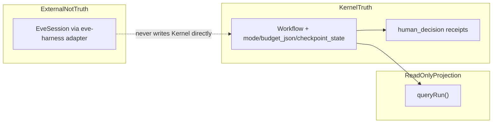

# QuantFlow v4 Glossary

**STATUS: Implemented-unverified**

Canonical vocabulary for v4 work. Extends [`docs/v3/GLOSSARY.md`](../v3/GLOSSARY.md); **wins on resolved overloaded terms** in [v4 overloaded-noun resolutions](#v4-overloaded-noun-resolutions) below.

Do not create alternate terms for concepts already defined here. If a term is missing, add it here rather than coining a local alias elsewhere.

---

## Core Primitives

### Workflow

A persistent mission context. Wraps a goal, its participating tiles, tasks, receipts, and state cards. The top-level coordination unit. All tiles in a workflow share a `workflow_id`.

**Workflow IS the execution instance (R3a decision, §10.1 resolved).** v4 needed an "execution instance" container. Rather than add a `Run` primitive — which would be the *third* meaning of "run" after Eve's session-scope unit and the loose verb — the Workflow is extended to be the instance: it gains `mode`, `budget_json`, and `checkpoint_state`. So **`run_id ≡ workflow_id`**. The projection surfaced to callers (`queryRun`) is a strictly read-only **aggregate of references** (the ids of the workflow's tasks/artifacts/receipts) plus the instance fields — it never copies their truth. Each mission = one execution instance; if/when a mission must host *many* instances over time, that is a future split, not v4. See [RUN (resolved)](#run-resolved--make-the-v3-decision-explicit-for-v4) and [Run anti-pattern](#run-anti-pattern).

**v4 Workflow instance fields** (on the `workflows` table; nullable on legacy rows):

| Field | Role |
| --- | --- |
| `mode` | Declares execution mode for the mission instance. Set via `kernel.workflow.create` / `kernel.workflow.update`. |
| `budget_json` | Declared budget caps (JSON object). **Declared in R3; enforced in R4** via Conductor + `queryRun` / `readRun`. |
| `checkpoint_state` | Conductor sequential-approval / human-checkpoint gate state. **The only authoritative "pause" noun** — see [PAUSE (resolved)](#pause-resolved). Values include `awaiting-selection`, `resumed`. |

### Tile

A visible canvas object. Can host a WorkerInstance, display a terminal, show a Conductor view, or represent any canvas participant. All tile state is Kernel-owned. The canvas renders tiles from Kernel snapshots.

### WorkerInstance

A runtime participant connected to a tile. Has exactly one Role, one Harness, and one Model. Not the same as a Role (type) or a Harness (adapter). A WorkerInstance is the running entity; its Role describes what function it performs.

### Role

The function a WorkerInstance plays in a workflow. Examples: `planner`, `coder`, `verifier`, `shell`. The Role is not the Harness and not the Model.

### Harness

The runtime adapter that bridges a WorkerInstance to its execution environment. Examples: `local-shell`, `herdr-shell`, `pi`, `codex`, `claude-code`, `mock`, **`eve-harness`**. Module home: `src/harness/`. The Harness is not the Role and not the Model. **`eve-harness` is a Harness kind** (QuantFlow runtime adapter to Eve's HTTP API) — not Eve's intra-agent loop; see [HARNESS (PROPOSED split)](#harness-proposed-split--needs-founder-confirm-before-a3).

### Model

The intelligence backend behind a WorkerInstance. Examples: `minimax`, `claude`, `gpt`, `local`, `openrouter`. The Model is not the Harness.

```text
role ≠ harness ≠ model
```

### Task

The coordination unit. A state-machine object owned by the Kernel. Moves through:

```text
open → claimed → working → submitted → verifying → complete
```

Tasks are not chat messages. Workers may not self-complete without verification evidence.

### TaskDependency

A declared prerequisite between tasks. Blocks a task from becoming claimable until its dependencies are met.

### Receipt

The evidence unit. Append-only proof of what a worker did, submitted, or completed. Canonical types:

```text
task_created, task_claimed, task_started, progress, artifact_created,
task_blocked, task_submitted, verification_started, verification_passed,
verification_failed, task_completed, task_failed,
human_decision (human checkpoint / operator choice),
planning   (Conductor planning evidence — Goal 5A; not a task transition)
```

Receipts are never deleted or modified.

### StateCard

The compressed current reality of a tile/worker. Fields: `current_task_id`, `status`, `blocker`, `last_meaningful_update`, `next_action`, `artifacts`, `caveman_summary`. Updated by watchers from task events, receipts, and terminal signals.

A StateCard is **not** a chat log. It is **not** a receipt chain. It answers: *what is this tile doing right now?*

### Artifact

A durable output produced during a task. Referenced in receipts. Examples: file path, code snippet, analysis result, test output.

### Event

An append-only state-transition record in the v3 model. Used by watchers to maintain StateCards and by the renderer to re-render the canvas. Never deleted.

**v4 clarification:** Kernel **events** are **transition notifications** emitted on committed state changes — not a persisted truth store in v4 (see `START_HERE.md` §2). Receipts are durable proof; events announce transitions to projection consumers.

### Connection

A visual link between tiles on the canvas. In v3 Goal 7, gains a semantic type:

```text
delegation, context_flow, artifact_dependency, verification,
blocker, receipt_handoff, manual_connection
```

### Permission

An access rule scoped to a WorkerInstance. Defines what the worker may read, write, or execute.

### Command

A Kernel operation request. The canonical entry point for any state mutation. All components (renderer, Conductor, MCP adapter) write state through Kernel commands.

---

## v4 projection and external terms

### queryRun

Read-only Kernel query. Projects **references only**: Workflow instance fields (`mode`, `budget_json`, `checkpoint_state`, `status`, timestamps) plus id lists (`taskIds`, `artifactIds`, `receiptIds`). **`run_id ≡ workflow_id`**. Never copies task/artifact/receipt row truth — doing so would be a second store. Implemented in `src/kernel/workflows/index.ts`. The return type `WorkflowRun` is a **projection shape**, not a Kernel primitive.

### EveSession

Eve cloud agent session unit — the object behind `POST /eve/v1/session` and follow-on stream/continuation calls (`/eve/v1/session/<id>`, `/stream`). Identified by an Eve session id (today stored as `eveSessionId` on `WorkerHandle` and as `sessionId` in `EveState` inside `src/harness/eve/index.ts`). **Not** a QuantFlow Workflow, not a Kernel primitive, not a second truth store. One `EveSession` may serve one WorkerInstance task delivery via the **`eve-harness` Harness adapter**. Eve's intra-agent driver loop is **`eve-session-loop`** — not "Harness."

### checkpoint_state

Workflow field (`workflows.checkpoint_state`). The **only** field or concept that may be called **"pause"** for the Conductor sequential-approval / human-checkpoint gate. Distinct from mission-level workflow status, Conductor loop phases, and `human_decision` receipts. Typical values: `awaiting-selection` (waiting for operator choice), `resumed` (checkpoint cleared, execution may continue).

### human_decision

Receipt type recording an operator's token-bound choice at a human checkpoint (e.g. which candidate to deepen). **Evidence of a decision — not pause state.** Append-only; paired with `checkpoint_state` transitions, not a substitute for them.

---

## Subsystem Terms

### Kernel

The sole source of truth. Hosts the SQLite state store, command handlers, query handlers, and event bus. All state mutations go through the Kernel. No other component may own canonical state.

### Canvas

The infinite canvas renderer (Electron renderer process). A visual projector of Kernel state. Not a database. User intent → Kernel command; Kernel event → canvas re-render. The canvas is never ahead of the Kernel.

### Conductor

The native in-process planner running in Electron main. Reads Kernel state through queries. Creates and manages tasks using native Kernel tools. Never owns truth. Never executes shell commands directly.

### Harness Layer

The collection of `WorkerHarness` adapter implementations. Each adapter wraps a different runtime environment. All produce receipts and StateCard updates through the same Kernel contract.

### MCP

The external adapter layer. Exposes Kernel commands and queries to external agents (Hermes, Claude Code, Codex, etc.) via the MCP server. Not the internal control plane. Not required for Conductor.

### Vault

The Obsidian knowledge mirror. Receives OKF-style exports of completed workflows, task summaries, and receipt chains. Not live state. Not a source of operational truth.

### Envoy

The task coordination bus. Routes task events between the Kernel and workers. Hosts the receipt chain. Backed by the Kernel's canonical task/receipt tables.

### herdr

The WSL session manager. Owns panes, Unix socket API, and agent state. Wrapped by the `herdr-shell` Harness adapter. Not replaced in v3.

---

## Anti-Patterns (Terms That Must Not Drive Design)

| Anti-pattern | Why |
| --- | --- |
| **canvas-as-database** | The canvas is a projector. |
| **worker self-completion** | Workers submit; the Kernel verifies. |
| **MCP as internal fast path** | MCP is an external adapter. |
| **vault as live state** | Vault is a durable knowledge mirror. |
| **string relay** | Retired. Do not revive. |
| **profile (fusing role+harness+model)** | `role ≠ harness ≠ model`; keep them separate. |
| **second source of truth** | Every component derives state from the Kernel. |
| <a id="run-anti-pattern"></a>**`Run` as a new primitive** | "Run" is overloaded (Eve owns session-scope units). v4 does NOT add a `runs` table — the **Workflow is the execution instance** (`run_id ≡ workflow_id`); `queryRun` is a references-only projection. A `runs` table duplicating Workflow = the second-store failure. |

---

## v4 overloaded-noun resolutions

One canonical name per meaning. Code and docs must not use overloaded nouns unqualified after A3.



### RUN (resolved — make the v3 decision explicit for v4)

| Meaning | Canonical v4 name |
| --- | --- |
| Execution instance (mission container + instance fields) | **`Workflow`** (`run_id ≡ workflow_id`) |
| Read-only aggregate of references + instance fields | **`queryRun`** (projection; type `WorkflowRun` is not a primitive) |
| Eve cloud session unit | **`EveSession`** (distinct from Workflow) |

**Banned:**

- Colloquial **"run"** as a noun/primitive in code or authority docs.
- A **`runs` table** or **`Run` primitive** (= second store).
- Treating **`WorkflowRun`** / **`runId`** as authority (they are projection aliases only).

### HARNESS (approved — founder 2026-06-25)

| Meaning | Canonical v4 name | A3 action |
| --- | --- | --- |
| Per-WorkerInstance runtime adapter (`local-shell`, `herdr-shell`, `codex`, `claude-code`, `pi`, `mock`, **`eve-harness`**) | **`Harness`** — KEEP | Do not rename module `src/harness/`, table `harnesses`, `harnessKind`, or kind string **`eve-harness`**. |
| Eve cloud intra-agent driver loop | **`eve-session-loop`** | Rename prose/code that calls Eve's loop a "harness". |
| Eve cloud session object | **`EveSession`** | Align `EveState.sessionId` → `eveSessionId` in adapter code. |

**Banned:**

- Unqualified **"harness"** when meaning Eve's internal **`eve-session-loop`**.
- Conflating **`EveSession`** with **`Harness`** (the adapter bridges to Eve; it is not the session).

### PAUSE (resolved)

| Concept | Canonical name | Notes |
| --- | --- | --- |
| Conductor sequential-approval / human-checkpoint gate | **`checkpoint_state`** | **The only "pause" noun.** |
| Operator choice at checkpoint | **`human_decision`** receipt | Evidence — **not** pause state. |
| Mission-level workflow suspend | **`workflows.status`** value **`'suspended'`** (today `'paused'`) | Mission suspend — not checkpoint pause; rename in A3 after A2 freezes `WorkflowStatus`. |
| Conductor loop step outcomes | Loop phases **`'awaiting_operator'`**, **`'budget_exceeded'`**; `ActionProposal.kind === 'await_operator'` | Transient control flow — not the canonical pause noun; A3 renames from `'paused'` / `'budget-paused'` / `'pause'`. |
| Watchtower UI scroll freeze | `watchtowerPaused` | Unrelated UI cache — KEEP, do not call a Kernel pause. |

**Banned:**

- Ad-hoc **`pause`** / **`paused`** flags outside **`checkpoint_state`** for checkpoint semantics.
- Calling **`human_decision`** a pause or pause state.

---

## RENAME MAP (codemod input)

> **APPROVED — founder 2026-06-25.** Apply in order: **A2** signature rows first (RPC/MCP/`WorkflowStatus`), then **A3** mechanical renames. **Stage D** rows are excluded from A3 — do not touch in the vocabulary codemod PR.
>
> **KEEP** rows document sites A3 must **not** touch.

### RUN — RENAME (A3 — after A2 lands)

| File | Old | New | Notes |
| --- | --- | --- | --- |
| `src/kernel/workflows/index.ts` | `WorkflowRun` | `WorkflowProjection` | Keep `queryRun` function name |
| `src/kernel/workflows/index.ts` | `runId` field | remove; `workflowId` only | Alias today: `runId === workflowId` |
| `src/kernel/queries/index.ts` | `queryRun as runGet` | remove `runGet` alias | Export `queryRun` only |
| `src/kernel/queries/index.ts` | `WorkflowRun` type export | `WorkflowProjection` | |
| `src/kernel/context/envelope.ts` | envelope field `run_id` | `workflow_id` | Redundant with task.workflowId |
| `src/kernel/context/envelope.test.ts` | `envelope.run.run_id` | `envelope.workflow.workflow_id` | Match envelope shape rename |
| `src/main/conductor/conductor-loop.ts` | `readRun` dep | `readWorkflowProjection` | |
| `src/main/conductor/conductor-loop.ts` | `WorkflowRun` type | `WorkflowProjection` | |
| `src/main/conductor/conductor-loop.test.ts` | helper `run()`, `readRun` | `workflowProjection()`, `readWorkflowProjection` | |
| `src/main/conductor/conductor-ipc.ts` | `readRun` | `readWorkflowProjection` | |
| `src/main/conductor/run-replay.ts` | file `run-replay.ts` | `workflow-replay.ts` | |
| `src/main/conductor/run-replay.ts` | `runId` | `workflowId` | |
| `src/main/conductor/run-template-runner.ts` | file `run-template-runner.ts` | `workflow-template-runner.ts` | Optional filename; **`run-templates/` dir KEEP** |
| `quantflow-electron/scripts/smoke-*.ts` (dag, pod, checkpoint, run-template, event-projection, judgment) | `readRun`, `queryRun` locals named `run` | prefer `projection` / `workflowProjection` | `queryRun` fn name KEEP |

### RUN — A2 signature rows (freeze in contract doc; implement before or with A3)

| File | Old | New | Notes |
| --- | --- | --- | --- |
| `quantflow-electron/src/main/ipc-kernel-reads.ts` | RPC `kernel.run` | `kernel.workflowProjection` | External IPC contract |
| `tools/quantflow-mcp/tool-definitions.js` | `quantflow_kernel_run` | `quantflow_kernel_workflow_projection` | Update description: drop "Run" noun |
| `tools/quantflow-mcp/tool-definitions.test.js` | tests for `quantflow_kernel_run` | match tool rename | |
| `src/kernel/schema/types.ts` | `WorkflowStatus 'paused'` | `'suspended'` | Mission-level status enum |
| `src/kernel/migrations/001-v3-baseline.sql` | comment `'paused'` | `'suspended'` | Comment/migration strategy TBD in A2 |

### RUN — Stage D only (exclude from A3 PR — truth-collapse / mirror retirement)

| File | Old | New | Notes |
| --- | --- | --- | --- |
| `quantflow-electron/src/main/runtime-state/types.ts` | `run_id` fields | `workflow_id` | Legacy mirror; retire with Stage D |
| `quantflow-electron/src/main/runtime-state/events-repo.ts` | `run_id` | `workflow_id` | |
| `quantflow-electron/src/main/runtime-state/tasks-repo.ts` | `run_id` | `workflow_id` | |
| `quantflow-electron/src/main/runtime-state/artifacts-repo.ts` | `run_id` | `workflow_id` | |
| `quantflow-electron/src/main/runtime-state/migrations/002-orchestration-spine.sql` | `run_id` column | `workflow_id` | Migration strategy TBD in Stage D |
| `quantflow-electron/src/main/orchestration-service.ts` | `runCreate`, `runGet`, `runList`, `runCancel` | `workflow*` or retire with mirror | Legacy orchestration API |
| `quantflow-electron/src/main/ipc-orchestration.ts` | `orchestration.run*` channels | align with service rename | |

### RUN — KEEP (do not codemod)

| Symbol / path | Reason |
| --- | --- |
| `queryRun()` | Canonical projection query name (spec) |
| `run-templates/` | Saved workflow config — not an execution-instance primitive |
| `run-templates/AGENTS.md` | Config-only boundary |
| Colloquial "golden run", "npm run", "runs the model" | Not domain nouns |
| QA layer label "harness" (`qa/` test runner) | Different namespace |
| `quantflow_orchestration_run_*` MCP tools | Legacy orchestration mirror — rename only if orchestration service renamed (coordinate with Stage D) |

### HARNESS — RENAME (A3 — approved)

| File | Old | New | Notes |
| --- | --- | --- | --- |
| `src/harness/eve/index.ts` | `EveState.sessionId` | `eveSessionId` | Align with `WorkerHandle.eveSessionId` |
| `src/harness/eve/index.ts` | `state.sessionId` usages | `state.eveSessionId` | All read/write sites in file |
| `src/harness/eve/index.test.ts` | assertions on `sessionId` | `eveSessionId` | |
| `docs/v4/EVE_SETUP.md` | prose "Eve harness" meaning Eve loop | `eve-session-loop` | Adapter sections keep **`eve-harness`** |
| `BUILD_PLAN_V4.md` | "Eve's intra-agent loop" as harness | `eve-session-loop` | § Eve vocab locks ~L182–187 |
| `BUILD_PLAN_V4.md` | `task↔sessionId` (Eve mapping) | `task↔eveSessionId` | R4 durable-pod row |
| `docs/v4/handoffs/R4-durable-pod-runtime.md` | `task ↔ sessionId` | `task ↔ eveSessionId` | |
| `quantflow-eve/` (out-of-repo) | Eve-internal "harness" for agent loop | `eve-session-loop` | Separate audit; not in QuantFlow A3 PR |

### HARNESS — KEEP (runtime adapter — do not codemod)

| Symbol / path | Reason |
| --- | --- |
| `src/harness/**` module path | Established execution boundary |
| `harnesses` table, `harness_id`, `harnessKind`, `WorkerHarness` | Kernel + adapter contract |
| Kind string **`eve-harness`** | Registered Harness kind in `src/harness/registry.ts` |
| `createEveHarness`, `eveHarness` descriptor | Adapter factory — KEEP names |
| `quantflow-electron/src/main/harness-service.ts`, `harness-ops.ts` | Live adapter wiring |
| `createRoleSpawnHarness` (canvas-rpc tests) | Test double — not domain Harness |
| Layer label **harness** (`START_HERE.md` §8) | Process taxonomy |
| Span names `harness.spawn`, `harness_executing` | Perf taxonomy — adapter layer |

### PAUSE / CHECKPOINT — RENAME (A3 — approved; `WorkflowStatus` row in A2 above)

| File | Old | New | Notes |
| --- | --- | --- | --- |
| `src/main/conductor/conductor-planner.ts` | `ActionProposal.kind: 'pause'` | `'await_operator'` | Approved synonym |
| `src/main/conductor/conductor-loop.ts` | loop phase `'paused'` | `'awaiting_operator'` | Transient step status |
| `src/main/conductor/conductor-loop.ts` | loop phase `'budget-paused'` | `'budget_exceeded'` | |
| `src/main/conductor/conductor-loop.ts` | `kind: 'pause'` in proposals | `'await_operator'` | |
| `src/main/conductor/conductor-loop.test.ts` | `'budget-paused'`, `'paused'` expectations | match loop phase renames | |
| `src/main/conductor/conductor-ipc.ts` | `pauseRun`, `status: 'paused'` payload | `suspendWorkflow`, `status: 'suspended'` | Mission suspend hook |
| `src/evals/rubrics/index.ts` | `phase === 'paused'` | `'awaiting_operator'` | Match loop phases |
| `quantflow-electron/scripts/smoke-pod.ts` | `pauseRun`, `'paused'`, `'budget-paused'` | align with renames | |
| `quantflow-electron/scripts/smoke-checkpoint.ts` | `kind: 'pause'`, `'pause'` in proposedAction | `'await_operator'` | |
| `quantflow-electron/scripts/smoke-run-template.ts` | `kind: 'pause'` | `'await_operator'` | |
| `quantflow-electron/scripts/smoke-event-projection.ts` | `kind: 'pause'` | `'await_operator'` | |

### PAUSE / CHECKPOINT — KEEP (do not codemod)

| Symbol / path | Reason |
| --- | --- |
| `workflows.checkpoint_state` column | **The** pause field |
| `checkpointState` in commands/API | Kernel command payload |
| `human_decision` receipt type | Operator choice evidence — not pause |
| `quantflow-electron/.../renderer.js` `watchtowerPaused` | UI scroll pause — unrelated |
| `legend-dock.js` icon key `pause` | SVG icon name — unrelated |
| Operator-facing copy "pause/approve" in product docs | UX language when meaning checkpoint gate |
