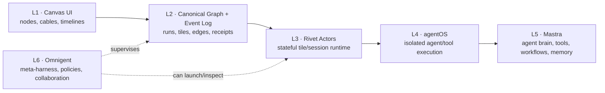

# QUANTFLOW v7 — "ACTOR-NATIVE" MISSION ORDER

> **Branch:** `quantflow-v7-actor-native` (cut from `quantflow-v6-actors` **after** v6's R5 live proof is green)
> **Builder:** Codex (autonomous), sliced into Task Cards (see §11)
> **Verifier:** founder re-runs each phase gate on his own machine before merge
> **Status:** SPEC — not yet started. v6 must land first (see §2).
> **One-line thesis:** *The canvas is a live projection of a durable actor graph. The backend is not hidden behind the canvas — the backend **is** the canvas.*
>
> **REVISION r2 (2026-07-07, post-Cursor-review — validated against the live repo).** r1 committed the exact sin it warned against: it proposed a **new parallel `CanvasEvent` log** while the repo already ships a frozen **33-kind `KERNEL_EVENT_KINDS` taxonomy** with `emitKernelEvent` as the *sole* fan-out and **receipts** as the durable proof backbone. r2 fixes this: **v7 EXTENDS the existing taxonomy, it does not fork it** (§3). Also corrected: Rivet hooks the tile-spawn seam (`pty.ts` + `tile-relay-dispatcher.ts`), **not** the worker-recovery `runtime-manager` (§4·L3); tiles and workers stay distinct (§4·L3); added an existing-inventory map (§2.5) and a **minimum-shippable cut** = V7.0–V7.2 only (§2.6). If r1 and r2 conflict anywhere, r2 wins.

---

## 0. THE VISION (read first)

Each **tile** on the canvas is not a UI box — it is a **durable backend actor**. Each **cable** is not a line — it is a typed communication channel. The whole system is legible because every layer speaks **one event language**.



**The one rule that keeps this from rotting — the THIN WAIST.** There is exactly one event vocabulary (§3). The UI *renders* it, Rivet actors *act on* it, Mastra agents *reason inside* it, Omnigent *supervises* it. Everything emits and consumes the same events.

> **The failure mode we are engineering against:** letting all three of Rivet / Mastra / Omnigent become orchestrators. Then you have three sources of truth. **The Kernel event log is the single truth. Nothing else is.**

**Strict one-job-per-layer contract:**

```
L2 Kernel   = the single source of TRUTH      (owns the graph + event log)
L3 Rivet    = where things LIVE                (durable actor lifecycle)
L4 agentOS  = where things RUN                 (isolated tool/shell execution)
L5 Mastra   = how agents THINK and use tools   (reasoning inside one actor)
L6 Omnigent = how humans/super-agents SUPERVISE(policy, collaboration, oversight)
L1 Canvas   = how the whole system is LEGIBLE  (projection of L2, nothing more)
```

---

## 1. What the founder will SEE when v7 is done

1. Spawn a tile from the legend → a **terminal tile** opens running a real CLI agent, **and it survives an app reload / crash** (its actor kept living; the tile re-attaches to the same running session).
2. Put the laptop to sleep, reopen → tiles that were mid-task **resume streaming** where they left off (actor hibernated + woke).
3. Draw a cable A→B → a **typed channel**; A delegates to B and B's reply returns over the wire — same as v6, but now the delegation is a durable, replayable event, not a fire-and-forget PTY paste.
4. Open the **timeline** on any tile → scrub its full event history (spawn → ready → each message → each artifact → completion), reconstructed from the event log.
5. Ask **Omnigent** (a supervisor tile): *"have Claude review what Codex just wrote in tile #3"* → it inspects tile #3's actor, spawns/uses a Claude actor, wires a temporary cable, and reports back — **without you drawing the cable by hand.**
6. Everything above keeps working if any of Rivet / agentOS / Mastra / Omnigent is **down** — the app degrades to the v6 local-PTY path.

That is the product. Every section below serves exactly that picture.

---

## 2. RELATIONSHIP TO v6 — anti-rebuild guardrails (non-negotiable)

v7 is **additive organization on top of a working v6**, not a rewrite. Read these before touching anything.

- **GATE ZERO — v6 must be green first.** Do not start v7 until v6 **V4** is green: `bun qa/run.ts a2a-cable` plus founder-visible proof (two tiles cabled, A messages B, reply on screen). See `docs/v6/ACTORS_MISSION.md` §V4. v6 V5 orchestrator is Phase 2 of v6, not a v7-min blocker. Record gate-zero sign-off in `docs/v7/reports/V7-0-FOUNDER-DECISIONS.md`. v7 branches from that commit. If v6 is red, **fix v6 first** — do not "fix it in v7."
- **Reuse, do not rebuild.** Every layer below has an **"Existing code — REUSE"** list. Codex must import/extend those modules, not reimplement them. Deleting a working v6 module to "clean up for v7" is a session-ending violation.
- **Ship-and-stop property.** Every phase (§7) ends with the app fully working. If v7 is abandoned at any phase boundary, the founder still has a shippable product. No phase may leave the app broken "until the next phase."
- **One runtime stays the default.** The v6 local-PTY + cable path is the **fallback runtime** and must keep working with Rivet/agentOS/Omnigent all disabled (kill switches, §7). Rivet is introduced *at the tile-spawn seam* (`dock-actors`/`tile-manager`) behind `QF_RIVET`, not in front of the existing path — and **not** via the worker-recovery `runtime-manager` (§4·L3).
- **No new source of truth.** Rivet actors, Mastra memory, and Omnigent policy all **derive** from the Kernel event log. If a fact must persist, it goes through a Kernel command (this is the one v-series rule we never drop). Actors may hold *cache*, never *truth*.
- **The terminal tile stays the star.** No state-card-first UI. Actors render as interactive terminals; timelines/graphs are optional back-of-tile views.
- **Guard against re-inflation.** This doc replaced the parked "RuntimeProvider spine / 6-runtime host" idea *only because* it adds the thin-waist discipline that idea lacked. If a phase starts feeling "too messy/confusing," that is the signal to stop and cut scope back to the thin waist — not to add another abstraction.

---

## 2.5 EXISTING INVENTORY — what stays (read before proposing anything new)

v7 is *organize + add 2 layers*, not a rewrite. Roughly 60% of the target architecture is already in the repo. Every module below has a decided fate. Codex must consult this table before creating a file — if a bucket says **Extend**, you extend that module; you do not build a parallel one.

| Bucket | Modules (live today) | Fate in v7 |
|---|---|---|
| **EXTEND** (build on, never fork) | `src/kernel/` (graph + commands + queries), `src/kernel/events/taxonomy.ts` (33 kinds) + `emitKernelEvent` (sole fan-out), `src/kernel/receipts/` (durable proof), `quantflow-electron/src/main/pty.ts` + `pty-readiness.ts` + `agent-adapter.ts` + `tile-relay-dispatcher.ts` (the v6 spine), `dock-actors.ts` (transport routing), canvas shell (`legend-*`, `tile-*`, `cable-*`, `canvas-rpc.js`), `src/harness/{agentos,herdr-shell,local-shell,sim,mock}/`, `main/mastra/`, `tools/quantflow-mcp/`, `qa/run.ts` | grows to carry actor durability + timeline |
| **DEMOTE** (keep code, not the face) | Conductor panel `src/main/conductor/` (loop/planner/dag-scheduler — full subsystem), state cards, watchtower operational log (`operational-event-log.js`) | stays wired, never the default UI; v7 does **not** delete or replace it |
| **FINISH** (structure-freeze debt v7 must not deepen) | `canvas-state.js` (read-through cache still imported across shell), `canvas-one-truth.test.ts` + `QF_ONE_TRUTH`, `renderer.js` (~4k-line god file), `REBUILD_QUEUE.md` Stages A–H | v7 must **not add new debt on top**; see §2.5.1 |
| **NEW (behind flags)** | Rivet `TileActor`/`actor-registry`, Omnigent `supervisor`/`policies`/`collab`, Mastra in-actor `emit-event`/`actor-memory`, `tile-timeline.js` | all default-OFF (§8) |

### 2.5.1 Structure-freeze reconciliation (must resolve before V7.0)
`START_HERE.md` / `REBUILD_QUEUE.md` declare a **structure freeze**: v4 is **receipt-backed, not event-sourced**, and no new authority layer may be added. **Two things must be explicit before V7.0 starts (founder decision, §10):**
1. **Is the freeze lifted for v7, or does v7.0 fold in Stage D (one-truth collapse)?** v7 may not quietly step around it.
2. v7's event work is a **taxonomy extension** (§3), which is freeze-compatible (extends the existing contract, adds no second authority). This is the intended reading — but the founder confirms it, because it touches the frozen `KERNEL_EVENT_KINDS`.

## 2.6 MINIMUM SHIPPABLE CUT (do this first, prove it, then decide)

The review is right that 9 phases (V7.0–V7.8) / 3 new brains is a lot of default-off surface. **The real v7 payload is durability + legibility.** Ship this slice first and stop:

> **v7-min = V7.0 (taxonomy extension) + V7.1 (durable actors, survive reload) + V7.2 (replayable cables).**

**All post-v7-min work (V7.3–V7.8) is Phase 2**, gated behind a witnessed V7.2 proof plus founder sign-off in `docs/v7/reports/V7-0-FOUNDER-DECISIONS.md`. Mastra (V7.6) and Omnigent (V7.7) are the highest-risk Phase 2 layers — do not let Codex start L5/L6 cards before v7-min lands. V7.3–V7.5 are also Phase 2 (hibernate, agentOS durability, timeline UI).

---

## 3. THE THIN WAIST — one event vocabulary (THE keystone)

This is the single most important section. **Build this first (Phase V7.0). Nothing else may proceed until it is frozen.**

> **r2 correction — DO NOT build a new event system.** The repo already has the thin waist: `src/kernel/events/taxonomy.ts` (`KERNEL_EVENT_KINDS`, 33 frozen kinds) fanned out by `emitKernelEvent` (documented sole fan-out: *"No other module may send `kernel:event` or re-emit taxonomy kind strings"*), with `src/kernel/receipts/` as the durable proof backbone. **v7 EXTENDS this. It does not add `CanvasEvent`, a second log, or a second writer.** One enum, one writer (`emitKernelEvent`), one durable proof path (receipts). This is what makes the thin waist *real* instead of a parallel truth.

### 3.1 The envelope already exists — reuse it

```ts
// src/kernel/events/index.ts  (EXISTING — reuse verbatim, do not replace)
export interface KernelEventPayload {
  kind: KernelEventKind;      // the frozen taxonomy — v7 adds 3 kinds (§3.2)
  correlationId?: string;     // ties request ↔ reply (v7 cable pairing rides this)
  tileId?: string;            // canvas node
  workflowId?: string;
  taskId?: string;
  data?: unknown;             // per-kind payload
}
export function emitKernelEvent(payload: KernelEventPayload): void // sole fan-out
```

v7's only kernel-event change is **appending 3 kinds** to `KERNEL_EVENT_KINDS` (and to `docs/v4/EVENT_TAXONOMY.md`, kept in sync by the `taxonomy-sync` qa check). No new interface, no `id`/`ts`/`actorId` fields — worker/tile identity already lives on `tileId` + the worker rows.

### 3.2 The vocabulary — map to existing kinds, add exactly 3

The founder's conceptual event list (r1) maps almost entirely onto kinds that **already ship**. v7 adds **only the 3 marked NEW**.

| v7 concept | Kernel kind (existing unless NEW) | Emitter | Notes |
|---|---|---|---|
| tile started | `tile.created` (+ `worker.spawned` for the exec instance) | L3 | already emitted on spawn |
| tile ready | **`tile.ready`** (NEW) | L3 | fills the real gap — v6 had no readiness *event*, only the `awaitTileReady` gate |
| tile output | *(not a kernel event)* | — | streamed on the existing `pty:data` channel; **never** goes through `emitKernelEvent` (would flood the log). Timeline reads scrollback lazily, §4·L1 |
| cable connected | `connection.created` | L2 | typed `kind` rides `data` |
| cable removed | `connection.deleted` | L2 | |
| message sent | **`message.sent`** (NEW) | L3/L6 | pairs via `correlationId` |
| message replied | **`message.replied`** (NEW) | L3 | same `correlationId` as its `message.sent` |
| artifact created | `artifact.created` | L3/L4/L5 | exact match |
| task blocked | `task.blocked` | L3/L5/L6 | exact match |
| human approved | `human_decision` | L1/L6 | exact match |
| run completed | `task.completed` / `workflow.updated` | L3/L6 | overlaps the **Conductor** task/workflow model — do **not** invent a `RunCompleted`; reuse these (§3.3) |

So the entire v7 taxonomy delta is: **`tile.ready`, `message.sent`, `message.replied`** — 3 kinds appended to `KERNEL_EVENT_KINDS` + `docs/v4/EVENT_TAXONOMY.md`. Everything else already exists.

> **Rule (unchanged, now literal):** before emitting anything, ask *"which existing `KERNEL_EVENT_KIND` carries this?"* If the honest answer is "none," it's one of the 3 new kinds — and adding a 4th is a founder decision (§10).

### 3.3 Relationship to Conductor / tasks / workflows / Watchtower (no orphans)

The review flagged that r1 left these unmapped. Explicit answers:
- **Conductor** (`src/main/conductor/` — loop/planner/dag-scheduler) is **not replaced** by Omnigent. Conductor drives `task.*`/`workflow.*` DAG execution; Omnigent (L6) is *human/super-agent supervision* that issues high-level intents and reads the same events. When Omnigent needs a run, it goes **through** the Conductor/task model, it does not shadow it. Their boundary: Conductor = automated plan execution; Omnigent = policy + collaboration + oversight.
- **`RunCompleted` / `TaskBlocked`** are **not new** — they are `task.completed`/`workflow.updated` and `task.blocked`. v7 adds no run/task authority.
- **Watchtower** (`operational-event-log.js`) stays as the **global** oversight feed (all kinds). The new per-tile `tile-timeline.js` (L1) is the **same stream filtered by `tileId`** — one event source, two views. Not a second timeline system.

### 3.4 Contract obligations per layer (unchanged path — now literal to the code)

- **L2 Kernel** owns the taxonomy and `emitKernelEvent` is the **sole** fan-out. Durable proof for anything that must survive is a **receipt** (`src/kernel/receipts/` + the `receipt.posted` kind), not a new log. Everyone else emits through Kernel commands / `emitKernelEvent`; nobody else writes truth.
- **L1 Canvas** subscribes read-only via the existing `kernel:event` IPC / `onKernelEvent` and renders. It must **never** mutate truth locally (already enforced in `canvas-state.js` and `operational-event-log.js` — preserve it).
- **L3/L4/L5/L6** emit through the same path and may keep a local **projection/cache** rebuilt from replaying events + receipts — never an authoritative store.

### 3.5 Acceptance for the extension itself

`bun qa/run.ts taxonomy-sync` (existing check) must stay green with the 3 new kinds present in both `taxonomy.ts` and `docs/v4/EVENT_TAXONOMY.md`. Add `bun qa/run.ts v7-actor-events` — asserts `tile.ready`/`message.sent`/`message.replied` fan out through `emitKernelEvent`, pair by `correlationId`, and that emitting an unknown kind is a **type error** (closed `KernelEventKind` union). Founder proof: none (invisible plumbing); the 3 kinds are frozen before Phase V7.1, and no 4th is added without §10 sign-off.

---

## 4. LAYER SPECS

Each layer below has the same shape so Codex can implement mechanically: **Job → Owns → Does NOT own → Existing code (REUSE) → New code → Interface → Invariants.**

### L1 · CANVAS UI

- **Job (one sentence):** make the live actor graph legible — render tiles, cables, and timelines as a pure projection of the event log.
- **Owns:** tile geometry preview, selection, drag/resize ephemera, cable drawing UX, timeline scrubber, viewport.
- **Does NOT own:** any durable fact. No local truth. No orchestration decisions.
- **Existing code — REUSE:**
  - `quantflow-electron/src/windows/shell/src/canvas-state.js` (read-through cache — keep its "not authoritative" contract)
  - `.../cable-draw-mode.js`, `cable-renderer.js`, `cable-overlay.js`, `cable-inspector.js`, `cable-math.js`
  - `.../tile-renderer.js`, `tile-manager.js`, `tile-interactions.js`, `tile-route-handles.js`
  - `.../legend-dock.js`, `legend-spawn.js`, `legend-readiness.js`
  - `.../operational-event-log.js` (already the non-canonical Watchtower feed)
  - `.../renderer-event-router.js`, `projection.js`, `canvas-truth.js`
- **New code:**
  - `.../tile-timeline.js` — per-tile timeline scrubber that replays kernel events for one `tileId` (created→ready→messages→artifacts→completion). Renders from the event stream only.
  - `.../cable-kind-badge.js` — render the `kind` of a typed channel (delegation / context-share / subscription) on the cable.
- **Interface:** consumes the existing `kernel:event` IPC / `onKernelEvent(payload: KernelEventPayload)`; produces intents via existing `canvas-rpc.js` → Kernel commands. **No new IPC surface for truth.**
- **Invariants:** rendering must be reconstructable purely from the event log (property test: feed the log to a fresh renderer → identical tiles/cables). Terminal is the default face; timeline is back-of-tile.

### L2 · CANONICAL GRAPH + EVENT LOG (Kernel)

- **Job:** be the single source of truth — own the graph (tiles, cables, runs, receipts) and taxonomy fan-out; receipts are durable proof.
- **Owns:** durable graph state, frozen taxonomy, `emitKernelEvent` fan-out, receipt append, replay queries.
- **Does NOT own:** how actors run, how agents think, how humans supervise. It records facts; it does not *do* work.
- **Existing code — REUSE:**
  - `src/kernel/` (the canonical graph — extend, do not fork)
  - `quantflow-electron/src/main/canvas-kernel-access.ts`, `canvas-kernel-sync.ts`, `canvas-rpc.ts`, `canvas-persistence.ts`
  - `quantflow-electron/src/main/canvas-one-truth.test.ts` (the guard test — extend it)
  - `qf_receipt_list`, `quantflow_kernel_*` MCP tools (`tools/quantflow-mcp/tool-definitions.js`)
- **New code (minimal — extension only):**
  - `src/kernel/events/taxonomy.ts` — **append** `tile.ready`, `message.sent`, `message.replied` to `KERNEL_EVENT_KINDS` (and mirror in `docs/v4/EVENT_TAXONOMY.md`).
  - `src/kernel/replay.ts` — a **read-side** helper: `replay(filter?: { tileId?; workflowId?; correlationId? }) → KernelEventPayload[]`, reconstructed from **receipts + kernel graph/worker rows** (receipt-primary; `emitKernelEvent` stays ephemeral). Extend patterns from `src/main/conductor/workflow-replay.ts`. Pure query; **not** a new store.
  - **No** `contract.ts` / `log.ts` / `validate.ts`. The envelope (`KernelEventPayload`), writer (`emitKernelEvent`), and durable proof (receipts) already exist.
- **Interface:** reuse `emitKernelEvent(payload: KernelEventPayload)` (sole writer) + `onKernelEvent(cb)` / `kernel:event` IPC (fan-out). The only addition is the read-side `replay(...)`.
- **Invariants:** `emitKernelEvent` stays the sole fan-out. `canvas-one-truth.test.ts` + `taxonomy-sync` must stay green. History is append-only (receipts never mutate). Any projection is reconstructable from replay + receipts.

### L3 · RIVET ACTORS (durable runtime) — **the biggest new layer**

- **Job:** be where things live — one durable, stateful actor per tile session that owns its lifecycle and survives reload, sleep, and crash.
- **Owns:** actor lifecycle state machine, PTY/session handle ownership, readiness gating, reply capture, hibernate/wake, re-attach on reload. Emits (via `emitKernelEvent`) `tile.ready`, `message.sent`, `message.replied`, `artifact.created`, and `worker.status_updated`.
- **Does NOT own:** truth (emits through Kernel + receipts), reasoning (L5 inside the actor), supervision (L6). An actor never decides *what* another actor should do — it executes and reports.
- **r2 — a TileActor is a `worker` bound to a `tile`, NOT `actorId === tileId`.** The kernel already separates **tiles** (canvas nodes, `tile.*`) from **workers** (execution instances, `worker.*` + `kernel.worker.*` commands). A `TileActor` owns a worker session attached to a tile. Reuse `worker.spawned/status_updated/stopped`; do not collapse the two identities.
- **Existing code — REUSE (TileActor wraps these directly):**
  - `quantflow-electron/src/main/pty.ts` (`awaitTileReady`, `writeToSession`, `onPtyData`) — spawn/IO surface
  - `quantflow-electron/src/main/pty-readiness.ts` (`waitForPtyReadiness` — quiescence/signal/timeout)
  - `quantflow-electron/src/main/agent-adapter.ts` (`AgentAdapter`, native-tui/server modes)
  - `quantflow-electron/src/main/tile-relay-dispatcher.ts` (`sendTileDelegate` → `delegateWindowsPty`/`captureRelayReply`/`notifySender`) — becomes the *inside* of `TileActor.send()`
  - `quantflow-electron/src/main/dock-actors.ts` + `windows/shell/src/tile-manager.js` — the **real** spawn seam where `TileActor` is selected
  - `src/harness/{local-shell,agentos,herdr-shell,sim,mock}/` — execution backends
  - `quantflow_orchestration_tile_heartbeat` MCP tool (existing heartbeat surface)
- **r2 — NOT `src/harness/runtime-manager/`.** That module is **worker stale/recover/restart against kernel worker rows** (`markStale`/`recoverTask`/`sweepStaleWorkers`), not a tile-spawn selector. Force-fitting Rivet behind it conflates two unrelated "runtime" concepts. `TileActor` hooks the tile-spawn seam above; the worker-manager keeps its recovery job and may later *call* the actor to restart it.
- **New code:**
  - `src/harness/rivet/tile-actor.ts` — the durable `TileActor`. State machine:
    ```
    Spawning → Ready → Busy → Idle → Sleeping → Ready (on wake) → Dead
                 -- re-attach on app reload (rebuild registry from replay + worker rows) --/
    ```
  - `src/harness/rivet/actor-registry.ts` — maps `tileId ↔ workerId ↔ live session handle`; rebuilt on boot by replaying kernel events + reading worker rows (re-attach).
  - `src/harness/rivet/index.ts` — Rivet config (actors, storage driver). Local/embedded Rivet only; **no cloud dependency**.
  - `quantflow-electron/src/main/rivet-bridge.ts` — bridges the `dock-actors`/`tile-manager` spawn seam to `TileActor`, engaged only when `QF_RIVET=1`.
- **Interface:**
  ```ts
  interface TileActor {
    spawn(spec: TileSpec): Promise<void>;           // emits tile.created + worker.spawned
    awaitReady(): Promise<void>;                     // wraps pty-readiness; emits tile.ready
    send(msg: { text: string; correlationId: string }): Promise<void>; // emits message.sent
    onReply(cb: (r: { text: string; correlationId: string }) => void): Unsubscribe; // message.replied
    hibernate(): Promise<void>;                       // persist worker state, release process if idle
    wake(): Promise<void>;                            // re-attach or relaunch, emit tile.ready
    kill(): Promise<void>;                            // emits worker.stopped
    state(): ActorState;                              // derived, never the truth
  }
  ```
- **Invariants:** one actor = one session (no shared-session cross-talk except through an explicit cable). Durable state derives from replay + receipts + worker rows — killing the app and reopening rebuilds the registry. Rivet fully disableable (`QF_RIVET=0` → v6 in-process spawn path, app still works).

### L4 · agentOS (execution chamber)

- **Job:** be where things run — give an actor an isolated place to execute tools, shell commands, coding agents, and filesystem ops, so "this tile is alive" is real, not a terminal illusion.
- **Owns:** the sandboxed execution environment (WSL sidecar today), tool/shell invocation, credential order, the kill switch.
- **Does NOT own:** lifecycle (L3 decides when to spawn/sleep), truth (L2), reasoning (L5).
- **Existing code — REUSE (this layer is ~built):**
  - `src/harness/agentos/` (adapter), `tools/agentos-host` (WSL sidecar), HTTP/SSE transport, credential order (OpenCode Zen → OpenRouter → Anthropic), kill switch, prewarm.
  - `quantflow-electron/src/main/agentos-service.ts`, `agentos-terminal-bridge.ts`, `agentos-run.ts`, `agentos-approval.ts`, `agentos-prewarm.*`.
- **New code:** thin only — `TileActor` (L3) calls agentOS through its existing transport. Add `runtime: "agentos"` as one execution backend a `TileActor` can own. **No new agentOS surface for v7.**
- **Interface:** unchanged from v6 (`connectTerminal`/`openShell`/`cable/send` over the sidecar). L3 is the only caller.
- **Invariants:** app survives agentOS down (kill switch green → agentOS tiles show "unavailable", everything else works). Approval is optional/inline, never a blocking card (v6 rule, preserved).

### L5 · MASTRA (agent brain)

- **Job:** be how agents think — define tools, workflows, memory, and evals **inside a single actor**. Make each actor intelligent; do not let it own the product graph.
- **Owns:** an agent's tool set, its workflow/steps, its per-actor memory, its MCP tool exposure, evals.
- **Does NOT own:** cross-tile orchestration (that's a cable/L6 decision), truth (L2), lifecycle (L3). **Mastra runs *inside* an actor, one brain per actor.**
- **Existing code — REUSE (partial today):**
  - `quantflow-electron/src/main/mastra/index.ts` (Mastra instance)
  - `quantflow-electron/src/main/mastra/agents/conductor.ts` (existing agent)
  - `quantflow-electron/src/main/mastra/tools/delegate-to-tile.ts` (already bridges Mastra → a cable delegation)
  - `src/evals/` (eval harness)
- **New code:**
  - `quantflow-electron/src/main/mastra/tools/emit-event.ts` — lets a Mastra agent emit taxonomy kinds (`artifact.created`, `task.blocked`, `message.sent`) via `emitKernelEvent`, so its reasoning is legible on the canvas.
  - `quantflow-electron/src/main/mastra/memory/actor-memory.ts` — per-actor memory keyed by `{ tileId, workerId }`, **rehydrated from replay + receipts** (not a parallel store).
  - Keep `delegate-to-tile.ts` as the *only* way a Mastra agent talks to another tile — it already routes through the cable, keeping the thin waist.
- **Interface:** a Mastra agent receives `{ tileId, workerId, kernelEventApi, cableSend }` at construction; every outward action is an event or a cable send. No direct actor-to-actor calls. (`workerId`/`tileId` are runtime handles — not new kernel envelope fields.)
- **Invariants:** Mastra never writes truth directly (goes through L2). One brain per actor. `delegate-to-tile` is the single cross-tile door.

### L6 · OMNIGENT (supervision plane)

- **Job:** be how humans/super-agents supervise — policy, multi-agent oversight, session sharing, and collaboration ("ask Claude to review Codex"). **Not in the hot path of every tile message.**
- **Owns:** policies (who may spawn/delegate/approve), collaborative oversight flows, run-level orchestration decisions, import/export of sessions.
- **Does NOT own:** per-message routing (that's L3 over a cable), truth (L2), execution (L4). Omnigent *watches the log and issues high-level intents*; it does not sit between two chatting tiles.
- **Existing code — REUSE (partial today):**
  - `quantflow-electron/src/main/agentos-orchestrator.ts` (autonomous delegation seed)
  - `quantflow_orchestration_*` MCP tools: `run_create/get/list/cancel`, `capability_register/list`, `resolve_route`, `tile_heartbeat`
  - `qf_task_*` / `qf_envoy_*` MCP tools (the task/envoy supervision surface)
  - `quantflow_watchtower_snapshot` (oversight view)
- **New code:**
  - `quantflow-electron/src/main/omnigent/supervisor.ts` — reads the event log, applies policy, and issues high-level intents (spawn actor, open cable, request approval). Uses the **native-tui integration-mode pattern only** (per the Omnigent reference) — **no Mastra-in-Omnigent, no server half.**
  - `quantflow-electron/src/main/omnigent/policies.ts` — declarative policy (spawn/delegate/approve gates), evaluated against events, not hardcoded.
  - `quantflow-electron/src/main/omnigent/collab.ts` — the "have X review Y" flow: inspect target actor → recruit reviewer actor → open temporary cable → collect → `task.completed`/`workflow.updated`.
- **Interface:** `Supervisor.onEvent(e)` (read) + `Supervisor.issue(intent)` (high-level: `spawnActor`, `openCable`, `requestApproval`, `shareSession`). Never intercepts `message.sent`/`message.replied` between two other tiles.
- **Invariants:** Omnigent is fully disableable (`QF_OMNIGENT=0` → manual cables still work, app unchanged). It observes and issues; it does not become the message bus.

---

## 5. THE THIN-WAIST DISCIPLINE (how the layers connect)

One picture, memorize it:

```
Rivet    = where things LIVE
agentOS  = where things RUN
Mastra   = how agents THINK and use tools
Omnigent = how humans/super-agents SUPERVISE
Canvas   = how the whole system becomes LEGIBLE
Kernel   = the single TRUTH everyone reads and writes through
```

- **Every arrow between layers is a `KernelEventPayload` (via `emitKernelEvent`) or a Kernel command. Nothing else.**
- No layer calls another layer's internals. Rivet does not import Mastra; Omnigent does not import Rivet's registry; Canvas imports nothing but the kernel event stream.
- If Codex finds itself adding a direct cross-layer import, that is a design smell → route it through the kernel event/command path instead.

---

## 6. DIRECTORY / MODULE LAYOUT (where new code goes)

```
src/kernel/
  events/
    taxonomy.ts        EXTEND  append tile.ready, message.sent, message.replied
  replay.ts            NEW     read-side query over events + receipts (no new store)
  receipts/            REUSE   durable proof backbone (already exists)
src/harness/
  runtime-manager/     REUSE   worker recovery — UNCHANGED, not the Rivet hook
  rivet/               NEW  L3
    tile-actor.ts
    actor-registry.ts
    index.ts
quantflow-electron/src/main/
  rivet-bridge.ts      NEW     dock-actors/tile-manager spawn seam → TileActor (gated QF_RIVET)
  dock-actors.ts       EXTEND  select TileActor at spawn when QF_RIVET=1
  mastra/              REUSE + extend  L5  (Phase 2 — after v7-min)
    tools/emit-event.ts        NEW
    memory/actor-memory.ts     NEW
  omnigent/            NEW  L6  (Phase 2 — after v7-min)
    supervisor.ts
    policies.ts
    collab.ts
quantflow-electron/src/windows/shell/src/
  tile-timeline.js     NEW  L1  per-tile filter of the SAME kernel event stream as Watchtower
  cable-kind-badge.js  NEW  L1  typed-cable badge
docs/v4/
  EVENT_TAXONOMY.md    EXTEND  mirror the 3 new kinds (taxonomy-sync qa check)
tools/quantflow-mcp/
  tool-definitions.js  REUSE + extend  expose replay + supervisor intents
qa/
  run.ts               REUSE   add v7-* gates
docs/v7/
  V7_MISSION.md        this file
  reports/V7-<phase>-REPORT.md  one per phase (§7)
```

---

## 7. PHASE LADDER

Each phase = one visible step, one runnable gate, and the **ship-and-stop property**. Do phases in order. A phase that fails its gate twice after an honest repair → stop, write the report, escalate (§9).

> Convention (matches v6): gate = `bun qa/run.ts <name>` green **on the founder's machine**; founder proof = a thing the founder can see. Every gate command below must exist as a scripted sim + a real run.

> **v7-min = V7.0 + V7.1 + V7.2 (§2.6).** Build and founder-prove these three first. V7.3–V7.8 are Phase 2, gated behind a witnessed V7.2 proof.

### V7.0 — Extend the taxonomy (the keystone) · L2
- **Do:** append `tile.ready`, `message.sent`, `message.replied` to `KERNEL_EVENT_KINDS` + `docs/v4/EVENT_TAXONOMY.md`; add read-side `src/kernel/replay.ts`. **No new log, no new writer** — everything rides `emitKernelEvent` + receipts. First resolve §2.5.1 (structure-freeze) with the founder.
- **Files:** `src/kernel/events/taxonomy.ts`, `docs/v4/EVENT_TAXONOMY.md`, `src/kernel/replay.ts`; extend `canvas-one-truth.test.ts`.
- **Gate:** `bun qa/run.ts taxonomy-sync` stays green + `bun qa/run.ts v7-actor-events` (§3.5) — 3 kinds fan out via `emitKernelEvent`, pair by `correlationId`, unknown kind is a type error.
- **Founder proof:** none (invisible plumbing). The 3 kinds are frozen; no 4th without §10 sign-off.
- **Ship-and-stop:** app behaves exactly like v6; the taxonomy just gained 3 kinds nobody emits yet.

### V7.1 — Tiles become durable actors (re-attach on reload) · L3
- **Do:** implement `TileActor` + `actor-registry`; route local-PTY spawns through it at the `dock-actors`/`tile-manager` seam (NOT `runtime-manager`); emit `tile.created`/`worker.spawned`/`tile.ready`. On reload, rebuild the registry from replay + worker rows and re-attach live sessions.
- **Files:** `src/harness/rivet/*`, `rivet-bridge.ts`, extend `dock-actors.ts`; reuse `pty.ts`/`pty-readiness.ts`/`agent-adapter.ts`.
- **Gate:** `bun qa/run.ts v7-actor-reattach` — spawn actor, kill+restart the main process (sim), assert re-attach and `tile.ready` fires without relaunching the CLI.
- **Founder proof:** spawn a `claude` tile, reload the app, the tile **is still there and still connected** — not a fresh blank terminal.
- **Ship-and-stop:** `QF_RIVET=0` → identical to v6. `QF_RIVET=1` → tiles survive reload.

### V7.2 — Durable cables (delegation as a replayable event) · L3+L2
- **Do:** move `sendTileDelegate` inside `TileActor.send()`; every delegation is `message.sent`→`message.replied` sharing a `correlationId`, emitted via `emitKernelEvent` and replayable. Cable rendering unchanged.
- **Files:** wrap `tile-relay-dispatcher.ts` inside `tile-actor.ts`; emit through Kernel.
- **Gate:** `bun qa/run.ts v7-durable-cable` — A→B delegation, reply captured, **then `replay({correlationId})` reconstructs the exchange** including the sent/replied pairing.
- **Founder proof:** cable two `claude` tiles, send a message, reply returns (v6 behavior) — **plus** replay reconstructs the pair (timeline UI lands V7.5).
- **Ship-and-stop:** cables work identically; they're just durable now. **← v7-min ends here; founder proves, then decides on Phase 2.**

### V7.3 — Hibernate / wake (survive sleep) · L3  *(Phase 2 — gated behind witnessed V7.2 proof)*
- **Do:** implement `hibernate()`/`wake()`; idle actors release the process and persist state; on wake they re-attach or relaunch and emit `tile.ready`.
- **Files:** `tile-actor.ts` state machine, `actor-registry.ts`.
- **Gate:** `bun qa/run.ts v7-hibernate` — idle → hibernate → wake → resumes; mid-stream output continues after wake.
- **Founder proof:** sleep the laptop with a tile mid-task, reopen → the tile **resumes streaming**, not dead.
- **Ship-and-stop:** with hibernation off, actors just stay live (V7.1 behavior).

### V7.4 — agentOS actors on the same fabric · L4 (mostly reuse)  *(Phase 2 — gated behind witnessed V7.2 proof)*
- **Do:** let a `TileActor` own an `agentos` execution backend (not just local PTY). Reuse all of `agentos-*`. No new agentOS surface.
- **Files:** `tile-actor.ts` (backend selection), reuse `agentos-terminal-bridge.ts` etc.
- **Gate:** `bun qa/run.ts v7-agentos-actor` — an agentOS-backed actor spawns as a terminal, does a trivial task, survives reload (V7.1) and kill switch (L4 invariant).
- **Founder proof:** an AgentOS tile is now a durable actor too — reload-survivable.
- **Ship-and-stop:** agentOS down → those tiles show "unavailable", everything else fine.

### V7.5 — Timeline UI (make it legible) · L1  *(Phase 2)*
- **Do:** build `tile-timeline.js` + `cable-kind-badge.js`; render purely from `replay({ tileId })` — the **same** kernel event stream Watchtower already consumes, filtered to one tile. Not a second timeline system.
- **Files:** `windows/shell/src/tile-timeline.js`, `cable-kind-badge.js`, hook into `tile-renderer.js`.
- **Gate:** `bun qa/run.ts v7-timeline` — feed a known event history, assert the rendered timeline matches the sequence exactly (projection property test).
- **Founder proof:** open a tile's timeline, scrub its whole history (created→ready→messages→artifacts→done).
- **Ship-and-stop:** it's a back-of-tile view; front terminal unchanged.

### V7.6 — Mastra brain inside an actor · L5  *(Phase 2 — gated behind witnessed v7-min proof)*
- **Do:** wire a Mastra agent into a `TileActor` with `emit-event` + per-actor memory; keep `delegate-to-tile` as the only cross-tile door; run evals. **Mastra does not replace Conductor** (§3.3) — a Mastra brain reasons *inside one actor*; Conductor still owns DAG/task execution.
- **Files:** `mastra/tools/emit-event.ts`, `mastra/memory/actor-memory.ts`, reuse `mastra/agents/conductor.ts`.
- **Gate:** `bun qa/run.ts v7-mastra-actor` — a Mastra actor reasons, emits `artifact.created`/`task.blocked`, and its memory rehydrates from replay after restart.
- **Founder proof:** a "smart" tile whose thinking shows up as events on its timeline; it remembers across reload.
- **Ship-and-stop:** `QF_MASTRA=0` → plain CLI tiles (v6).

### V7.7 — Omnigent supervision · L6  *(Phase 2 — gated behind witnessed v7-min proof)*
- **Do:** build `supervisor.ts` + `policies.ts` + `collab.ts`; reads the kernel event stream, issues high-level intents, runs the "have X review Y" flow. Native-tui pattern only. **Omnigent supervises; it does not become the message bus or replace Conductor** (§3.3) — run completion is `task.completed`/`workflow.updated`, not a new kind.
- **Files:** `omnigent/*`, reuse `agentos-orchestrator.ts` + orchestration MCP tools + the Conductor task model.
- **Gate:** `bun qa/run.ts v7-omnigent-collab` — given a goal, the supervisor inspects a target actor, recruits a reviewer actor, opens a temporary cable, collects a review, emits `task.completed`/`workflow.updated`; a denied-by-policy spawn is blocked.
- **Founder proof:** tell the supervisor tile "have Claude review Codex's work in tile 3" → it wires it up and reports back, **cables drawn automatically.**
- **Ship-and-stop:** `QF_OMNIGENT=0` → manual cables only (V7.2 behavior).

### V7.8 — Proof loop + demo · all layers
- **Do:** end-to-end scripted proof + screenshots to `docs/v7/reports/evidence/`; founder demo script covering §1's six items.
- **Gate:** `bun qa/run.ts v7-demo` green **twice consecutively**.
- **Founder proof:** the §1 walkthrough, live.

---

## 8. KILL SWITCHES (degradation contract)

The app must run with any combination of these OFF, always degrading to a working state:

| Flag | OFF behavior |
|---|---|
| `QF_RIVET` | in-process v6 runtime; no reload-survival/hibernate |
| `QF_AGENTOS` (exists) | agentOS tiles show "unavailable"; local PTY works |
| `QF_MASTRA` | plain CLI tiles, no in-actor reasoning |
| `QF_OMNIGENT` | manual cables only, no autonomous supervision |

`bun qa/run.ts v7-degradation` must prove the all-off configuration equals v6 behavior.

---

## 9. GATE POLICY (from v5/v6 lessons — do not relearn)

- Every blocking gate is a command **green on the founder's machine**, with a scripted **sim** and a **real** run. A host-baseline failure is fixed by a named repair chunk, never by silently narrowing scope or a permanently-red check.
- **No self-approval:** the process that builds a chunk never verifies it. The founder (or a second pass) re-runs the proof and audits the diff before merge.
- A gate that fails twice after an honest repair → **stop the phase, write `docs/v7/reports/V7-<phase>-REPORT.md`, escalate.** Do not improvise past red.
- CRLF phantom `M` on shell files with empty diffs = ignore. `Rebuild Prompt.md`, `logs/`, `eve-agents/*/node_modules` are operator/ignored files — never commit or delete.
- Never push `quantflow-v4`, `quantflow-v5-fabled`, `quantflow-v6-actors`, or `main`. Never force-push. v7 lives on `quantflow-v7-actor-native`.

---

## 10. DEFERRED TO FOUNDER (do not do; list in each report)

1. Merging `quantflow-v7-actor-native` anywhere.
2. Adopting **Rivet Cloud** (v7 uses embedded/local Rivet only — no cloud dependency, no spend).
3. Retiring the v6 herdr/Eve fallback lanes (v7 keeps them as fallback).
4. Any spend beyond existing API keys; paid agentOS models (free default stays).
5. Flipping any kill switch to default-ON (all v7 flags ship default-OFF until the founder witnesses the proof).
6. Adding any event type to the §3 vocabulary.

---

## 11. HOW TO FORMAT WORK FOR CODEX (task cards)

You said Codex builds it all — here is the format. **Do not hand Codex this whole file.** Slice each phase into **Task Cards**, one card per Codex session. A card is self-contained: Codex should never need to guess.

### 11.1 Task Card template

```md
# CARD V7.<phase>.<n> — <short title>
BRANCH: quantflow-v7-actor-native   (never push protected branches)
LAYER: L<n> · <name>
DEPENDS ON: <card ids that must be green first>

## Goal (one sentence, observable)
<what is true when this card is done>

## Reuse — DO NOT reimplement
- <path>  (<what to call / extend>)
- <path>

## Files you may create/edit (allowlist — touch nothing else)
- <path>   (new | edit)
- <path>

## Interface to implement
```ts
<the exact signature(s) from §4>
```

## Event contract touched (§3)
- emits: <KERNEL_EVENT_KINDS this card emits via emitKernelEvent>
- consumes: <kinds this card reads via onKernelEvent/replay>

## Acceptance gate (must be green)
`bun qa/run.ts <gate-name>`   +   <the founder-visible proof>

## Invariants you must not break
- <the relevant §4 invariant + kill switch>

## Report
Write docs/v7/reports/V7-<phase>-REPORT.md: pasted gate output, deviations WITH reasons, findings.
```

### 11.2 Rules for slicing phases into cards
- **One layer per card** wherever possible (keeps the thin waist clean).
- **Allowlist the files.** Codex edits only listed files; touching others is a violation. (This is what stopped the v6 "watchtower churn" regression.)
- **Every card ends green.** No card may leave the tree broken for the next card.
- **Interface-first.** Give Codex the exact TypeScript signature from §4 — do not let it invent the shape.
- **Gate is a command, not a vibe.** Every card names a `bun qa/run.ts` gate that must exist and pass.
- **Sim before real.** The gate ships as a scripted sim first, then a real run — so Codex can self-check before the founder re-verifies.

### 11.3 Suggested card sequence
```
# ── v7-min (build + founder-prove FIRST) ──
V7.0.0  founder decisions recorded (§2.5.1 + replay substrate)  (gate)
V7.0.1  append 3 kinds to taxonomy + EVENT_TAXONOMY.md   (L2)
V7.0.2  src/kernel/replay.ts (read-side over events+receipts) (L2)
V7.1.1  TileActor state machine + registry (worker↔tile)  (L3)
V7.1.2  rivet-bridge at dock-actors/tile-manager seam      (L3)
V7.1.3  re-attach on reload from replay + worker rows      (L3)
V7.2.1  send() wraps tile-relay-dispatcher                 (L3)
V7.2.2  message.sent/replied correlationId pairing + replay(L2/L3)
# ── Phase 2 (only after v7-min is witnessed green) ──
V7.3.1  hibernate/wake                                     (L3)
V7.4.1  agentOS execution backend on TileActor             (L4)
V7.5.1  tile-timeline.js (filter of Watchtower stream)     (L1)
V7.5.2  cable-kind-badge.js                                (L1)
V7.6.1  emit-event tool + actor-memory                     (L5)
V7.7.1  supervisor + policies                              (L6)
V7.7.2  collab "have X review Y"                           (L6)
V7.8.1  end-to-end demo + evidence                         (all)
```

---

## 12. SESSION END

Stop (with a report) when: a gate fails twice after an honest repair; a non-negotiable (§2) would have to bend; the event vocabulary (§3) would need to change; or a §10 founder decision is required. Otherwise keep going. **v7 is done when V7.8's gate is green twice and the §1 demo script runs live on the founder's machine.**

---

### Appendix A — Reference, not dependency
- **Rivet** (`rivet.gg`): actor model + durable state + hibernation. v7 uses the *pattern* and embedded/local runtime. Not a cloud commitment.
- **Omnigent** (`github.com/omnigent-ai/omnigent`): copy the **native-tui integration-mode pattern only** — not its server half, no framework lock-in. (Same rule as v6.)
- **Mastra**: agent brain framework, already partially wired at `main/mastra/`. Stays *inside* actors, never owns the graph.
- **agentOS**: the v5/v6 execution sidecar — reused wholesale.
